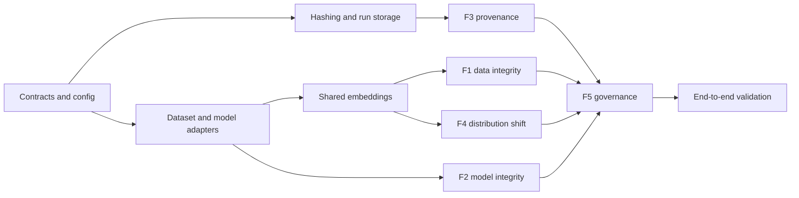

# Sentinel Phase 2 - Implementation Flow

**Document ID:** SENTINEL-P2-IMPLEMENTATION  
**Version:** 1.0  
**Delivery window:** 12 calendar days  
**Repository root:** `D:\SIH\sentinel`  
**Implementation language:** Python 3.10

## 1. Delivery Strategy

Implementation proceeds contract-first. Schemas, typed domain objects, canonicalization, and deterministic fixtures are established before feature engines. Each module is independently testable, but integration remains a single sequential process. No frontend work is included.

The build order follows technical dependency rather than presentation order:



## 2. Repository Structure

```text
D:\SIH\sentinel\
|-- README.md
|-- pyproject.toml
|-- requirements.txt
|-- requirements-dev.txt
|-- .gitignore
|-- configs\
|   |-- default.yaml
|   |-- thresholds.yaml
|   `-- coverage_manifest.yaml
|-- schemas\
|   |-- finding.schema.json
|   |-- assurance-report.schema.json
|   |-- inference-provenance.schema.json
|   |-- audit-log.schema.json
|   |-- coverage-statement.schema.json
|   `-- run-manifest.schema.json
|-- sentinel\
|   |-- __init__.py
|   |-- __main__.py
|   |-- pipeline.py
|   |-- core\
|   |   |-- __init__.py
|   |   |-- enums.py
|   |   |-- models.py
|   |   |-- errors.py
|   |   |-- normalizers.py
|   |   `-- schema_registry.py
|   |-- adapters\
|   |   |-- __init__.py
|   |   |-- datasets.py
|   |   `-- models.py
|   |-- modules\
|   |   |-- __init__.py
|   |   |-- data_integrity.py
|   |   |-- model_integrity.py
|   |   |-- inference_provenance.py
|   |   |-- distribution_shift.py
|   |   `-- governance.py
|   `-- utils\
|       |-- __init__.py
|       |-- embeddings.py
|       |-- hashing.py
|       |-- paths.py
|       |-- atomic_io.py
|       `-- config.py
|-- scripts\
|   |-- generate_synthetic_models.py
|   |-- inject_label_flips.py
|   |-- generate_duplicate_fixture.py
|   |-- generate_ood_fixture.py
|   `-- verify_run.py
|-- tests\
|   |-- fixtures\
|   |-- unit\
|   |   |-- test_hashing.py
|   |   |-- test_atomic_io.py
|   |   |-- test_normalizers.py
|   |   |-- test_dataset_adapter.py
|   |   |-- test_model_adapter.py
|   |   |-- test_data_integrity.py
|   |   |-- test_model_integrity.py
|   |   |-- test_provenance.py
|   |   |-- test_distribution_shift.py
|   |   `-- test_governance.py
|   |-- integration\
|   |   |-- test_end_to_end_clean.py
|   |   |-- test_end_to_end_poisoned.py
|   |   |-- test_unavailable_paths.py
|   |   `-- test_fail_open.py
|   `-- acceptance\
|       |-- test_f1_metrics.py
|       |-- test_f2_badnets.py
|       |-- test_f3_mutations.py
|       `-- test_f4_ood.py
|-- reference_models\                 # operator/generated, gitignored
|-- reference_data\                   # operator-provided, gitignored
|-- wheelhouse\                       # offline packages, gitignored
|-- cache\                            # derived embeddings/spectra, gitignored
|-- output\
|   |-- staging\
|   `-- runs\
`-- docs\
    `-- phase2\                       # copies or links to governing specifications
```

## 3. Module Contracts

### 3.1 Core domain layer

Implement enums before engines:

```text
Pillar: F1, F2, F3, F4, F5
Disposition: ACCEPT, REVIEW, QUARANTINE, INCONCLUSIVE
Severity: INFORMATIONAL, LOW, MEDIUM, HIGH, CRITICAL
ModuleStatus: COMPLETED, PARTIAL, UNAVAILABLE, FAILED
TaskType: CLASSIFICATION, OBJECT_DETECTION, SEGMENTATION
ModelFormat: PYTORCH, TORCHSCRIPT, ONNX
ProvenanceStatus: SIGNED, UNSIGNED
VerificationVerdict: VALID, TAMPERED, CHAIN_BROKEN, UNAVAILABLE, UNSUPPORTED
```

Enum member names are uppercase in Python. Their JSON values are the lowercase spellings defined by the six schemas (for example, `Disposition.REVIEW.value == "review"`).

Domain objects must match the Backend Schema document. Engine code may not emit ad hoc dictionaries; conversion to dictionaries happens at the serialization boundary.

### 3.2 Configuration

Configuration loading shall:

1. parse local YAML;
2. reject unknown security-sensitive keys;
3. resolve defaults into an explicit materialized configuration;
4. normalize paths relative to `D:\SIH\sentinel` or an explicitly supplied input root;
5. validate threshold ranges and resource limits;
6. exclude the HMAC secret from the configuration object; and
7. produce a canonical configuration digest.

### 3.3 Adapters

Dataset adapters produce occurrence-preserving `DatasetManifest` objects. Model adapters expose stable `forward`, `state_dict`, `architecture_id`, `format`, and `digest` operations. Stub adapters for deferred formats raise typed `CapabilityDeferredError` containing capability and target phase.

## 4. Twelve-Day Implementation Plan

### Day 1 - Contracts and repository foundation

- Create the repository tree, packaging metadata, lint/test configuration, and `.gitignore`.
- Materialize the six JSON Schema files from the Backend Schema.
- Implement enums, immutable domain models, typed errors, and schema registry.
- Add golden valid/invalid schema fixtures.

**Exit gate:** schemas load offline; all golden valid fixtures pass and invalid fixtures fail for the expected reason.

### Day 2 - Cryptographic and filesystem primitives

- Implement streaming SHA-256 file hashing.
- Implement key parsing, domain-separated HMAC, constant-time verification, and canonical JSON.
- Implement safe allowed-root path resolution and reparse-point checks.
- Implement exclusive staging-directory creation, atomic file replacement, and final directory rename.
- Implement authenticated audit-entry construction and verification.

**Exit gate:** deterministic MAC vectors pass; bit flips, sequence changes, predecessor changes, and internal deletion/reordering are detected; tail-truncation limitation is tested and documented.

### Day 3 - Dataset/model adapters and embeddings

- Implement classification manifest ingestion and bounded image validation.
- Implement PyTorch state-dict and TorchScript model adapters.
- Implement typed ONNX/COCO/YOLO/task stubs.
- Implement frozen ResNet-18 extraction and cache identities.
- Ensure fold-local preprocessing utilities exist for F1.

**Exit gate:** a CIFAR-10 subset loads, produces deterministic 512-D embeddings, and reuses only a matching cache.

### Days 4-5 - F1 data integrity

- Implement five-fold out-of-fold logistic probabilities and CleanLab integration.
- Implement pHash generation/Hamming candidate matching.
- Implement chunked top-10 cosine search without an `N x N` allocation.
- Implement pair deduplication and connected duplicate clusters.
- Implement Isolation Forest percentile scoring.
- Implement source/class aggregation, statistical prerequisites, chi-square test, and fixed source dispositions.

**Exit gate:** seeded label flips, duplicates, outliers, and concentrated-source fixtures produce schema-valid evidence with stable scores.

### Days 6-7 - F2 model integrity and benchmark generation

- Implement tensor selection, shape validation, float64 SVD, L1 normalization, and spectrum caching.
- Implement architecture/key/shape equality checks.
- Implement per-layer Wasserstein distances, 95th-percentile aggregation, leave-one-out scores, and maximum-clean threshold.
- Implement BadNets generation using seeds 42-46 and deterministic continuation for rejected runs.
- Apply clean and poisoned quality gates; retain rejected-run metadata.
- Run one VGG-16 clean/poison compatibility smoke test.

**Exit gate:** all qualifying model artifacts are inventoried; the detector flags at least 4/5 poisoned ResNet-18 models and 0/5 clean calibration references, or records the actual missed acceptance target without concealment.

### Day 8 - F3 protected inference

- Implement canonical float32 output conversion and artifact retention.
- Implement component digests and binding HMAC.
- Implement authenticated ledger append with sequence and predecessor link.
- Implement generation and read-only verification.
- Implement unsigned fail-open path and fixed REVIEW control finding.

**Exit gate:** deterministic mutation tests cover each component, metadata field, chain order, missing artifact, changed external model, invalid key, and append failure.

### Day 9 - F4 distribution shift

- Implement Ledoit-Wolf fit and finite-input checks.
- Implement reference distance CDF/threshold and sample OOD findings.
- Implement stable float32 softmax, entropy, ratio, and zero-denominator guard.
- Implement suspicious-model dependency annotation.

**Exit gate:** CIFAR-10 versus SVHN scoring runs offline and produces the required ROC AUC measurement plus schema-valid batch characterization.

### Day 10 - F5 governance and orchestration

- Implement method-specific normalizer registry.
- Implement finding validation and fixed policy exceptions.
- Implement maximum-disposition aggregation and all-unavailable handling.
- Build coverage statement from static manifest plus actual runtime availability.
- Implement disposition trace and run manifest.
- Connect all stages in `pipeline.py`.

**Exit gate:** clean, poisoned, unavailable, partial, and unsigned scenarios all reach the expected overall disposition.

### Day 11 - Integration, security, and offline tests

- Run end-to-end clean and poisoned workflows.
- Verify output re-opening, schema validation, hashes, and HMAC chain.
- Test path traversal, duplicate IDs, non-finite tensors, malformed keys, output collisions, partial writes, and missing evidence.
- Run with outbound networking disabled and a prebuilt wheelhouse.
- Measure cold/cached runtime and peak memory separately.

**Exit gate:** no finalized run contains schema-invalid or unverifiable protected artifacts.

### Day 12 - Acceptance evidence and handoff

- Run F1/F2/F3/F4 acceptance suites.
- Record exact sample sizes, seeds, dependency versions, machine profile, rejected training runs, and actual metrics.
- Finalize README, coverage statement, usage examples, and known limitations.
- Perform a clean-machine offline installation rehearsal.
- Freeze the prototype tag/package without claiming SIH-final or production readiness.

**Exit gate:** all release-gate evidence is present, or unmet metrics are explicitly declared.

## 5. Exact Confidence Normalizer Registry

Every normalizer has a stable identifier stored in findings.

| Finding | Normalizer ID | Mapping |
|---|---|---|
| Label error | `cleanlab_inverse_quality_v1` | `clamp(1 - q, 0, 1)` |
| pHash duplicate | `phash_hamming_v1` | `0.70 + 0.30*(8-d)/8`, only `d<=8` |
| Cosine duplicate | `cosine_similarity_v1` | `0.70 + 0.30*(s-0.95)/0.05`, only `s>=0.95` |
| Isolation outlier | `empirical_percentile_v1` | percentile of adverse score within assessed set |
| Weight spectral | `threshold_excess_v1` | `0.70 + 0.30*min((D-T)/max(T,eps),1)`, only `D>T` |
| Mahalanobis OOD | `reference_percentile_v1` | percentile against reference distances |
| Low entropy ratio | `low_entropy_ratio_v1` | `0.70 + 0.30*(0.7-R)/0.7`, only `R<=0.7` |
| Possible drift | `fixed_review_policy_v1` | fixed REVIEW; confidence records anomaly strength only |
| Source concentration | `source_rule_v1` | fixed rule based on p-value and rate multiplier |
| Unsigned provenance | `unsigned_policy_v1` | fixed REVIEW |

All arithmetic is clamped to `[0,1]`. Every finding retains the unmodified raw score and decision threshold. These transformations support deterministic policy routing but remain `uncalibrated`.

## 6. Synthetic Benchmark Procedure

### 6.1 Model generation

For each initial seed 42-46:

1. deterministically initialize and train a clean ResNet-18;
2. train a separate poisoned ResNet-18 using 10% non-target samples stamped and relabeled to class 0;
3. evaluate clean test accuracy;
4. stamp the trigger onto every non-target test image;
5. evaluate clean-model triggered target rate or poisoned-model ASR;
6. accept only if the applicable gates pass; and
7. if rejected, continue with the next unused integer seed until the required count exists.

The checkerboard overwrites the last three rows and columns of all RGB channels. White is `1.0` after tensor conversion (or 255 before conversion); black is `0.0`.

### 6.2 Threshold and evaluation

For each clean reference, compute its model score against median spectra of the other four. Set `T` to the next representable float above the largest leave-one-out score. Re-score all five clean references using the same leave-one-out procedure for the reported calibration false-positive count. Score each poisoned model against median spectra of all five clean references.

This makes the reported 0/5 clean count a calibration-set property, not an independent FPR estimate. The report must use that exact wording.

## 7. Testing Matrix

| Layer | Test type | Required cases |
|---|---|---|
| Schemas | Unit/golden | valid, missing required, extra field, invalid enum, non-finite |
| Paths | Unit | traversal, absolute/relative mismatch, reparse escape, collision |
| Crypto | Unit | fixed vectors, wrong key, field bit flip, sequence edit, predecessor edit |
| Chain | Unit | internal delete, reorder, duplicate sequence, tail limitation |
| F1 | Unit/integration | fold leakage, label flip, self-neighbor, pair symmetry, cluster transitivity, low chi-square counts |
| F2 | Unit/acceptance | conv/linear shapes, bias exclusion, incompatible architecture, zero spectrum, non-finite weights, benchmark gates |
| F3 | Unit/integration | signed, unsigned, missing evidence, altered `.npy`, changed model, malformed key |
| F4 | Unit/acceptance | singular-prone covariance, stable softmax, zero entropy, high/low/neutral ratio, suspicious-model dependency |
| F5 | Unit/integration | max disposition, policy exceptions, all unavailable, trace completeness |
| Offline | Acceptance | local wheels and artifacts only, zero network calls |

## 8. Verification Commands

The README shall expose commands equivalent to:

```powershell
python -m pytest tests\unit -q
python -m pytest tests\integration -q
python -m pytest tests\acceptance -q
python scripts\generate_synthetic_models.py --config configs\default.yaml
python -m sentinel run --config configs\default.yaml
python scripts\verify_run.py --run-dir output\runs\<report_id>
```

Commands must not print the HMAC key. Acceptance commands must write their machine profile and dependency versions alongside results.

## 9. Performance Engineering Within the Python Constraint

- Batch PyTorch inference and avoid per-image device transfers.
- Preallocate or reuse arrays where practical.
- Use NumPy/SciPy/scikit-learn compiled kernels instead of Python loops for numeric work.
- Compute cosine neighbors in chunks and keep only top-k values.
- Cache embeddings and reference spectra under content/config identities.
- Stream file hashing rather than reading large model files into one bytes object.
- Avoid repeated image decoding between F1, F3, and F4 within a run.
- Profile before changing algorithms; preserve deterministic evidence over marginal speed.

C/C++ implementation, multiprocessing, GPU-only requirements, and native IPC remain explicitly deferred.

## 10. Definition of Done

The prototype is done when:

- all five modules exist and are orchestrated in the required order;
- typed contracts and six schemas agree;
- clean and poisoned fixture runs finalize correctly;
- every adverse finding retains evidence and uncalibrated confidence provenance;
- unavailable checks never masquerade as clean checks;
- HMAC and internal chain mutations are detected within the declared threat model;
- unsigned inference forces REVIEW;
- benchmark claims use demonstration-scale language;
- completed run directories are never overwritten by Sentinel;
- the complete workflow installs and runs without network access; and
- frontend/UI code has not been introduced.
