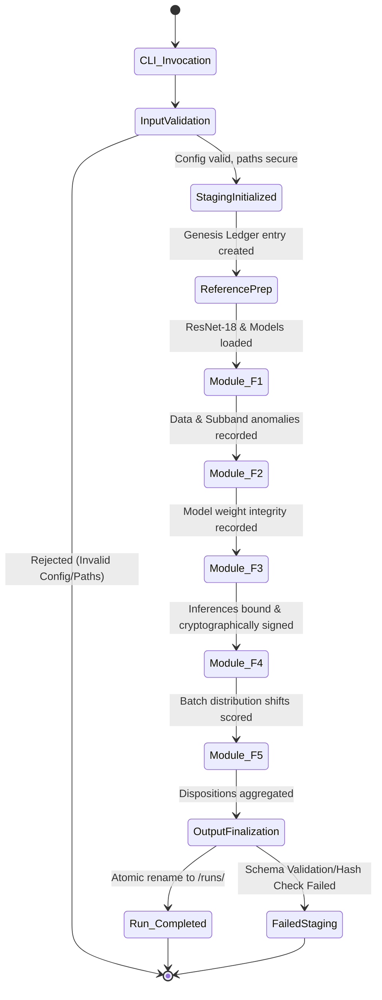
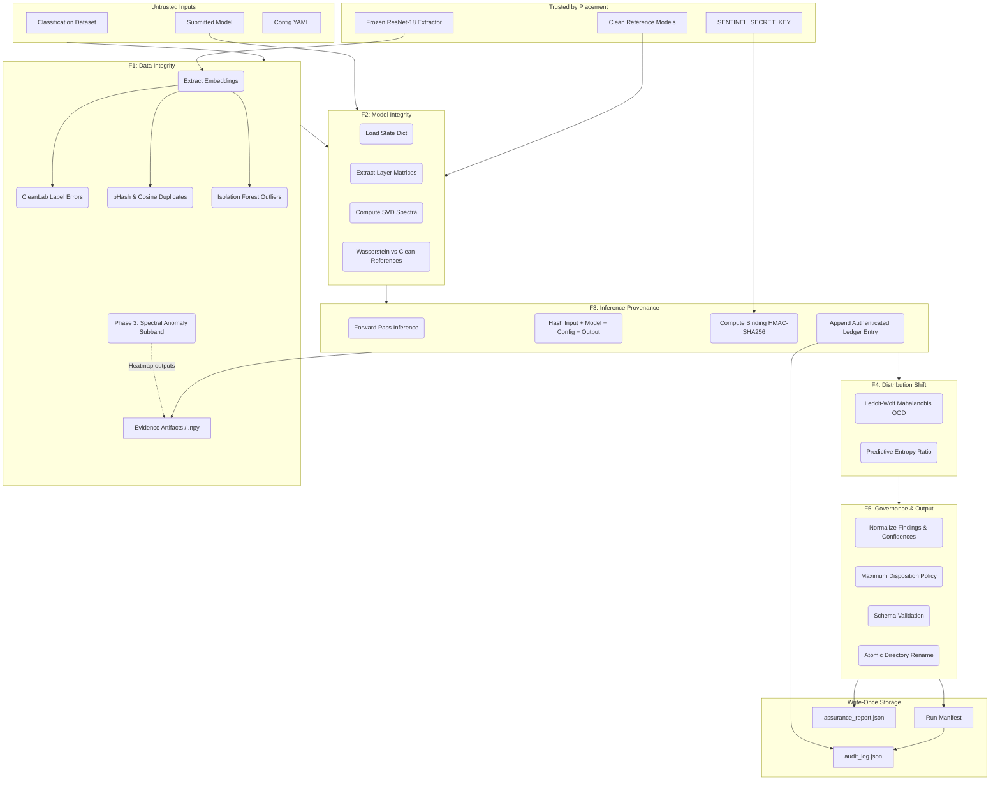

# Sentinel - System Technical Workflow

**Document ID:** SENTINEL-TECHNICAL-WORKFLOW  
**Version:** 1.0  
**Scope:** Phase 2 Baseline + Phase 3 Spectral Subband Integration  

This document visualizes and maps out the end-to-end technical execution of the Sentinel offline assurance pipeline.

## 1. Top-Level State Machine

The orchestration runs as a single, synchronous Python process (`pipeline.py`). To ensure cryptographic integrity and prevent partial or corrupted outputs, the system treats the output directory transactionally.

---

## 2. Component Data Flow (Pillars F1-F5)

This diagram details the sequence of mathematical and cryptographic operations that occur across the core assurance pillars.

---

## 3. Detailed Execution Sequence

### Phase A: Setup & Cryptographic Genesis
1. **CLI Parsing:** Sentinel is invoked without passing the secret key in the command arguments (it reads `SENTINEL_SECRET_KEY` from the environment).
2. **Path Sanitization:** Validates that no input datasets or models use path traversal escapes (`../`).
3. **Staging Creation:** Exclusively creates `output/staging/<uuid>.partial`.
4. **Ledger Genesis:** Initializes `audit_log.json`. The genesis block predecessor hash is set to 64 zeroes. 
   - *Fail-Open Rule:* If the secret key is missing, Sentinel proceeds but marks all records as `UNSIGNED` and flags the run for mandatory `REVIEW`.

### Phase B: Analysis & Feature Execution
1. **F1 Data Analysis:** 
   - Runs a 5-fold out-of-fold Logistic Regression against ResNet-18 embeddings to feed **CleanLab**.
   - Runs the **Phase 3 Spectral Subband Detector** (YCrCb, overlapping STFT, Polar Binning, Telea Inpainting). Outputs `.npy` and `.png` heatmaps only if patches are flagged.
2. **F2 Model Weights:** 
   - Slices convolution layers of the candidate model.
   - Computes Singular Value Decomposition (SVD) and compares the spectral signature against perfectly matching architecture references.
3. **F3 Inference Cryptography:**
   - Runs inferences. 
   - Hashes canonical forms of the image, the `.pt` file bytes, the config, and the `float32` output logits.
   - Computes `binding_hmac = HMAC-SHA256(key, "binding|hash1|hash2|hash3|hash4")`.
4. **F4 Distribution Shift:**
   - Compares batch-level predictive entropy against expected baseline distributions.

### Phase C: Aggregation & Finalization
1. **FDR & Thresholding:** Applies statistical normalizers (like Benjamini-Hochberg for the Spectral scanner) to control False Positive Rates.
2. **Governance Rollup:** Converts all anomalies into canonical `Finding` objects. Uses a max-severity rule (`QUARANTINE` > `REVIEW` > `ACCEPT`).
3. **Serialization:** 
   - Persists dataset evidence, heatmaps, and JSONs.
   - Builds `run_manifest.json` mapping every file to its SHA-256 digest.
4. **Final Commit:** 
   - Appends a final `run_finalized` block to the ledger, cryptographically committing to the manifest's digest. 
   - Closes, reopens, and performs a strict JSON-Schema validation on all outputs.
   - Atomically renames the folder from `staging/<id>.partial` to `runs/<id>`.
