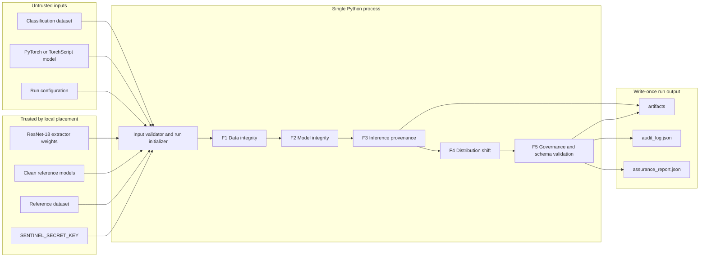
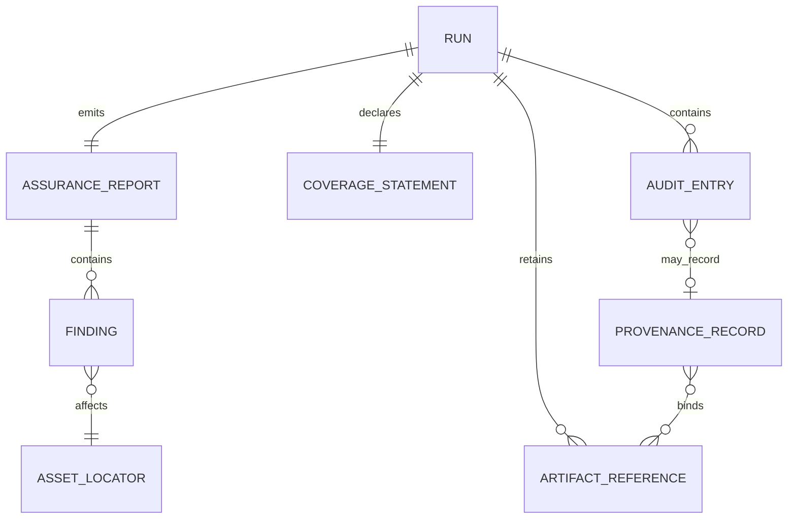
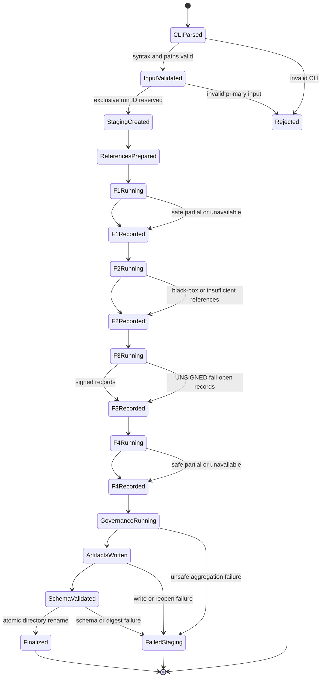
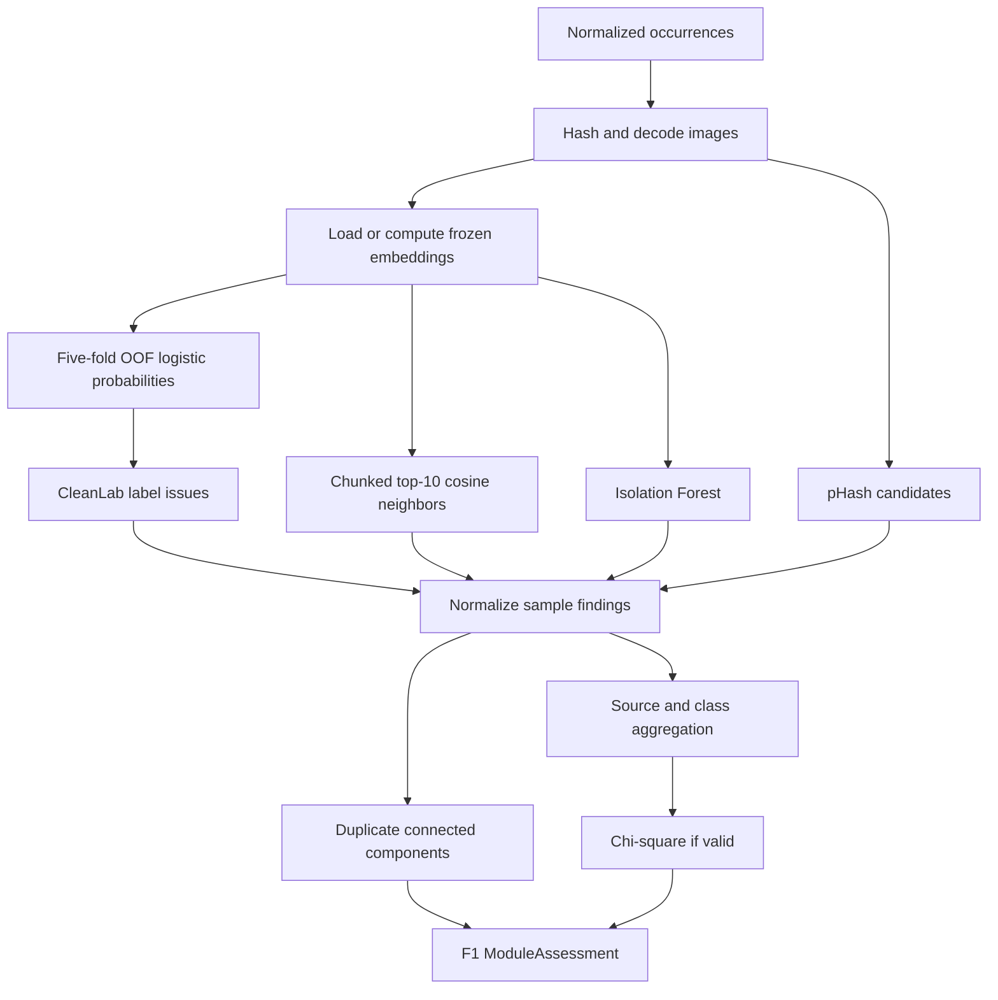
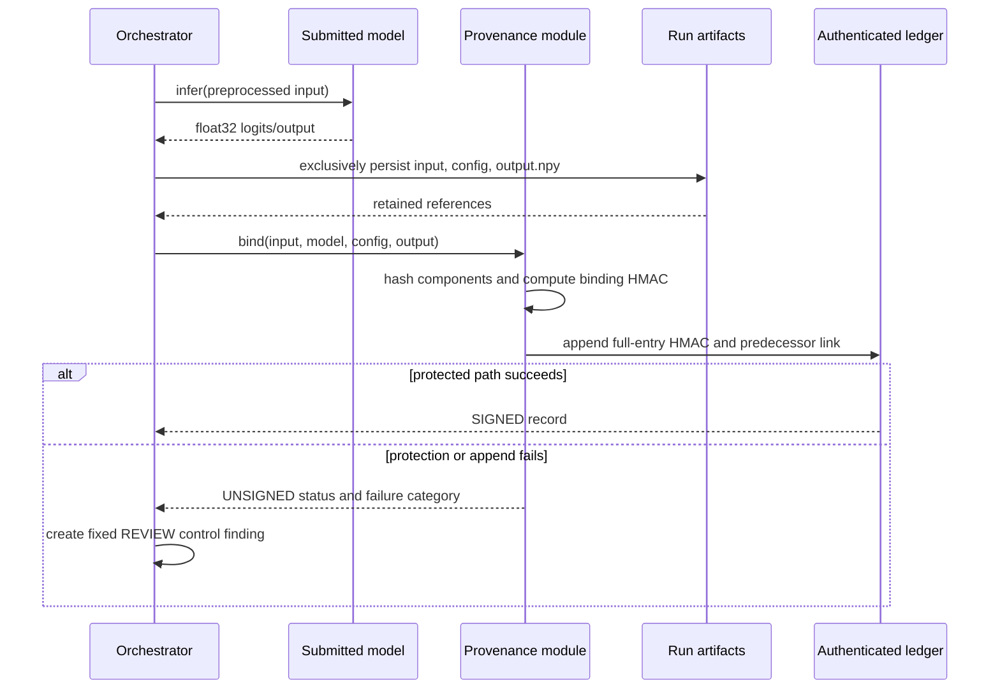
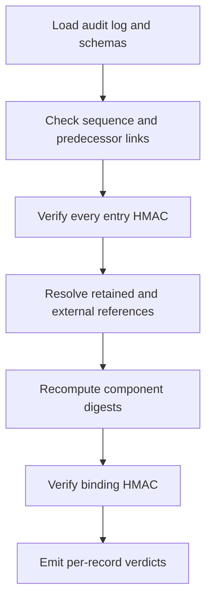
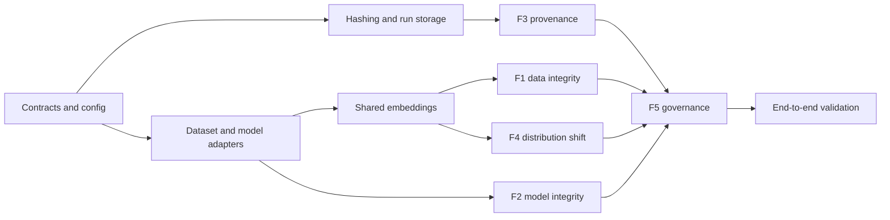

# Sentinel CV Assurance - Detailed Master Specification

This document compiles all detailed documentation and architecture specs for the Sentinel CV Assurance prototype.

---

<!-- Source: README.md -->

# Sentinel CV Assurance

Sentinel is a local, offline computer-vision integrity assurance prototype for SIH Problem
Statement 26228. It evaluates classification datasets, white-box model weights, generated
inference evidence, and distribution shift before producing a transparent governance
disposition: `accept`, `review`, `quarantine`, or `inconclusive`.

This repository implements the Phase 2 baseline. It is a single Python process with no
frontend, network service, database, project-owned IPC, or mandatory retraining of submitted
models.

## Assurance pillars

- F1: CleanLab label issues, pHash/cosine duplicates, Isolation Forest outliers, and
  contributor/source concentration.
- F2: same-architecture per-layer SVD spectra, Wasserstein distances, leave-one-out clean
  calibration, and a `nextafter` maximum-clean threshold.
- F3: exact input/model/config/output SHA-256 binding, HMAC-SHA256 provenance, authenticated
  audit chaining, read-only verification, and explicit `UNSIGNED` fail-open behavior.
- F4: Ledoit-Wolf Mahalanobis OOD scores and submitted-model predictive-entropy ratios.
- F5: canonical findings, fixed policy exceptions, maximum-disposition aggregation,
  coverage disclosure, and atomic application-level write-once reports.

The complete governing documents are under [`docs/phase2`](docs/phase2).

## Current status

The contracts, security/storage layer, F1-F5 engines, pipeline orchestration, verifier, and
fixture tooling are implemented. Unit and local integration tests pass on the available host.
Formal CIFAR-10/SVHN metrics and the 5-clean/5-poisoned ResNet-18 benchmark remain an explicit
acceptance activity because the required datasets, model artifacts, and CUDA-capable training
runtime are not present on this machine. No benchmark success claim is made in their absence.

See [`docs/IMPLEMENTATION_STATUS.md`](docs/IMPLEMENTATION_STATUS.md) for the precise evidence.

## Prerequisites

- Windows 10/11 x86-64
- Python 3.10
- Locally supplied CIFAR-10/SVHN assets, submitted model, reference models, and frozen
  ImageNet ResNet-18 extractor weights
- A 64-hex-character `SENTINEL_SECRET_KEY`
- A compatible GPU is strongly recommended for generating the formal twelve-model BadNets
  benchmark; normal assurance supports CPU execution.

## Connected staging and air-gapped installation

On a connected Windows staging machine with Python 3.10:

```powershell
python -m venv .venv
.\.venv\Scripts\python.exe -m pip download --dest wheelhouse -r requirements-build.txt -r requirements.txt
Get-FileHash wheelhouse\* -Algorithm SHA256 | Format-Table -AutoSize
```

Transfer the repository, wheelhouse, datasets, weights, and a separately reviewed hash
manifest into the air-gapped environment. Install without an index:

```powershell
python -m venv .venv
.\.venv\Scripts\python.exe -m pip install --no-index --find-links wheelhouse -r requirements-build.txt
.\.venv\Scripts\python.exe -m pip install --no-index --find-links wheelhouse -r requirements.txt
.\.venv\Scripts\python.exe -m pip install --no-index --no-build-isolation --no-deps -e .
```

Runtime code performs no model-hub or dataset downloads. Benchmark generation opens locally
present CIFAR-10 data with `download=False`.

## Input preparation

The classification manifest is JSON. Every occurrence has a unique ID and an image path
relative to the configured dataset root:

```json
{
  "dataset_id": "submitted-batch-001",
  "samples": [
    {
      "sample_id": "sample-0001",
      "image_path": "class_a/image.png",
      "label": 0,
      "source_id": "contributor-a",
      "batch_id": "batch-001"
    }
  ]
}
```

Copy `configs/default.yaml`, then set all local paths, submitted-model format and architecture,
inference sample IDs, references, extractor weights, preprocessing, and output root. The secret
is never stored in YAML or passed on the command line.

```powershell
$env:SENTINEL_SECRET_KEY = '<64 hexadecimal characters>'
.\.venv\Scripts\sentinel.exe run --config configs\default.yaml
```

Completed runs are written once to `output/runs/<report_id>/`. Interrupted work remains under
`output/staging/` and is never presented as a completed report.

## Verification

```powershell
$env:SENTINEL_SECRET_KEY = '<the verification key>'
.\.venv\Scripts\python.exe scripts\verify_run.py --run-dir output\runs\<report_id>
```

Provide `--expected-ledger-length N` when an independently retained expected length exists.
Without it, internal changes are authenticated but tail-truncation completeness is explicitly
unsupported.

## Tests and quality checks

```powershell
.\.venv\Scripts\python.exe -m pytest tests\unit tests\integration -q
.\.venv\Scripts\ruff.exe check sentinel scripts tests
.\.venv\Scripts\ruff.exe format --check sentinel scripts tests
```

Acceptance tests requiring external datasets/models are intentionally separate from the local
unit and integration suite.

## Security boundaries

Sentinel treats submitted datasets and models as untrusted, but the Phase 2 process is not a
sandbox. Safe PyTorch state-dict loading is used; arbitrary pickle model loading is excluded.
The host, operator, Sentinel code, Python runtime, configured references, verifier, and HMAC key
remain trusted. HMAC provides shared-secret integrity, not human identity or non-repudiation.
See [`SECURITY.md`](SECURITY.md) for reporting and the complete limitation summary.


---

<!-- Source: docs/IMPLEMENTATION_STATUS.md -->

# Sentinel Phase 2 Implementation Status

**Assessment date:** 2026-09-05
**Repository:** `ayushman4107/SIH-Project`
**Status:** Core implementation complete; external benchmark acceptance pending

## Completed implementation phases

| Phase | Scope | Commit |
|---|---|---|
| 1 | Packaging, six JSON contracts, enums/domain models, strict config, benchmark transform | `abc496b` |
| 2 | Hash/HMAC primitives, safe paths, atomic storage, dataset/model adapters, embeddings | `3e61038` |
| 3 | F1 data integrity, F3 provenance/ledger, deterministic confidence normalizers | `290fed0` |
| 4 | F2 spectral analysis, F4 shift analysis, executable BadNets trainer | `aab5902` |
| 5 | F5 governance, report/coverage/manifest finalization, pipeline CLI | `576f9e8` |
| 6 | Read-only verifier, adversarial fixtures, security/integration hardening | `0ebdce5` |

## Verified locally

- 43 unit and integration tests pass.
- Ruff static checks pass with Python 3.10 targeting.
- Six Draft 2020-12 schemas load locally; positive/negative finding fixtures validate.
- Provenance tests detect input/output mutation, metadata mutation, sequence deletion, and
  reordering.
- Tail truncation is detected only when an independent expected ledger length is supplied.
- Missing artifacts are reported as unavailable; changed artifacts are reported as tampered.
- Unsigned fail-open output forces review and is never represented as authenticated history.
- Report finalization validates schemas, manifest digests, final audit commitments, and
  application-level no-overwrite behavior.

The test host supplied Python 3.12, not the target Python 3.10. The package metadata constrains
supported execution to Python 3.10-3.12, and linting targets Python 3.10 syntax. A clean Python
3.10 offline installation rehearsal remains required.

## Acceptance work still required

The following claims are deliberately not marked as passed because the necessary assets or
runtime are absent from the current host:

- full CIFAR-10 F1 label-flip, duplicate, and outlier metrics;
- CIFAR-10 versus SVHN F4 ROC AUC;
- training and quality-gating five clean and five poisoned ResNet-18 models;
- the clean/poisoned VGG-16 compatibility smoke pair;
- F2 detection of at least 4/5 poisoned models with 0/5 clean calibration-reference flags;
- full CPU runtime, memory, and storage measurements;
- offline wheelhouse installation on a clean Python 3.10 machine.

The generator uses `download=False`, seeds 42 onward, exact non-target 10% poisoning, target
class 0, the fixed 3x3 bottom-right RGB checkerboard, and the specified CTA/TTR/ASR gates. It
retains rejected-attempt metadata and stops with an explicit error if it cannot produce the
required qualifying model count.

## Required next acceptance command

After local CIFAR-10 data and a CUDA-capable PyTorch environment are available:

```powershell
.\.venv\Scripts\python.exe scripts\generate_synthetic_models.py `
  --data-root reference_data `
  --output-dir reference_models\generated `
  --metadata artifacts\benchmark_attempts.json
```

Actual results must be recorded in the coverage statement without relaxing thresholds.


---

<!-- Source: docs/phase2/01_PRODUCT_REQUIREMENTS_DOCUMENT.md -->

# Sentinel Phase 2 - Product Requirements Document

**Document ID:** SENTINEL-P2-PRD  
**Version:** 1.1  
**Status:** Approved implementation baseline  
**Product stage:** Internal sub-48-hour hackathon prototype  
**Workspace:** `D:\SIH`  
**Problem statement:** SIH 26228 - Trustworthy Computer Vision Integrity Assurance for Data, Models, and Inference Outputs in Multi-Contributor Pipelines

## 1. Executive Summary

Sentinel Phase 2 is an offline, evidence-producing assurance tool for classification-oriented computer-vision pipelines. It evaluates an untrusted training dataset, an untrusted PyTorch or TorchScript model, and inference results produced during the run. It then emits a machine-readable assurance report recommending `ACCEPT`, `REVIEW`, `QUARANTINE`, or, when no assessment can be performed, `INCONCLUSIVE`.

The prototype does not attempt to prove that an asset is safe. It detects a defined set of integrity risks using reproducible heuristics and statistical methods, retains the evidence behind each adverse finding, and states where evidence is missing or a method is unavailable. Confidence values are deterministic, normalized anomaly-strength scores marked `uncalibrated`; they are not represented as true probabilities.

The product is intentionally narrower than the final SIH system. Phase 2 is a single-user, single-process Python CLI for Windows x86-64. It supports image classification, CIFAR-10-scale workloads, PyTorch and TorchScript models, HMAC-SHA256 provenance, and JSON file outputs. C++, databases, IPC, containers, dashboards, object detection, ONNX execution, asymmetric signatures, and durable replay prevention are deferred.

## 2. Product Vision and Principles

Sentinel provides a chain of evidence across five assurance pillars:

1. Inspect data for label errors, duplicate flooding, statistical outliers, and source-level concentration.
2. inspect model weights for architecture-matched spectral anomalies.
3. bind newly generated inference results to their input, model, and configuration, and verify those bindings later.
4. compare incoming data and model behavior against a declared reference distribution.
5. merge findings into a transparent, reproducible governance decision.

The governing principles are:

- **Zero implicit trust:** submitted datasets and models are untrusted. Reference assets are trusted only because the operator placed them in configured reference locations; that limitation must be reported.
- **Evidence before verdict:** every adverse finding contains its raw score, threshold, normalized confidence, affected asset, human-readable explanation, and recommended disposition.
- **Honest degradation:** an unavailable assessment is reported as `UNAVAILABLE`, never converted into a clean result.
- **No false precision:** all normalized confidence values are labeled `uncalibrated` until a statistically adequate calibration exercise exists.
- **Offline determinism:** normal execution must perform no network access or runtime downloads.
- **Non-invasive assurance:** assessment never requires retraining, fine-tuning, or otherwise modifying a submitted model. Training is performed only by the separate, team-owned synthetic benchmark generator.
- **Contributor-aware zero trust:** contributor/source identifiers are treated as attribution metadata, not as trust grants; every source is assessed by the same rules, and missing attribution is surfaced as a limitation.
- **Write-once runs:** a completed run directory is never modified by Sentinel. This is an application invariant, not filesystem-enforced immutability.

## 3. Scope

### 3.1 In Scope

- A CLI-driven, sequential assurance run on one Windows x86-64 machine.
- Classification datasets represented by an image directory plus labels and optional source/batch metadata.
- CIFAR-10 as the principal development and validation dataset.
- PyTorch `.pt` and TorchScript `.pt` classification models.
- Architecture-ready stubs for ONNX, COCO, YOLO, object detection, and segmentation that return explicit deferred-capability errors.
- Frozen ImageNet ResNet-18 embedding extraction with local weights.
- Label-error detection using CleanLab fed by five-fold out-of-fold logistic-regression probabilities.
- pHash and embedding-cosine duplicate detection.
- Isolation Forest statistical outlier detection.
- Source-level anomaly concentration and disposition.
- Per-layer SVD weight-spectrum comparison against same-architecture clean reference models.
- HMAC-SHA256 inference binding and HMAC-authenticated hash-chain entries.
- Generation and verification of provenance records.
- Ledoit-Wolf Mahalanobis OOD assessment and predictive-entropy batch shift assessment.
- A canonical JSON assurance report, audit log, coverage statement, and retained run evidence.

### 3.2 Non-Goals

- Frontend, dashboard, Figma, visualization, or desktop-shell integration.
- Production deployment or production-grade security certification.
- C/C++ modules, pybind11, local services, worker processes, IPC, UDS, shared memory, SQLite, LMDB, or content-addressable storage.
- Object-detection bounding-box assurance, segmentation, video, multimodal models, or ONNX execution.
- Black-box model fingerprinting or model assessment without loadable weights.
- Trigger discovery in submitted data, blended/physical trigger detection, adversarial-patch detection, architectural-backdoor detection, model-laundering detection, federated poisoning, or hardware compromise.
- Model remediation, pruning, unlearning, or fine-tuning of the submitted model.
- Cross-session replay detection, trusted timestamps, TPM/HSM/WORM anchoring, key rotation, key revocation, multi-user authorization, or protection from a compromised host administrator.
- A claim that an absence of findings proves safety.

## 4. Personas

### 4.1 Security Analyst

Runs an assessment, reviews evidence and limitations, and decides whether an asset should proceed. The analyst needs deterministic outputs, direct evidence references, and explicit coverage gaps rather than an opaque trust score.

### 4.2 Pipeline Operator

Prepares local datasets, submitted models, reference models, reference data, configuration, and the HMAC key. The operator needs offline installation, actionable validation errors, and predictable output locations.

### 4.3 Prototype Developer

Implements and validates detectors during a sub-48-hour sprint. The developer needs frozen contracts, deterministic seeds, separable modules, and testable acceptance criteria.

## 5. End-to-End User Outcome

Given a valid run configuration, Sentinel shall:

1. validate paths, formats, labels, metadata, reference assets, key material, and writable output location;
2. create a unique run identifier and an exclusively-created run directory;
3. calculate dataset and model digests and extract/cache embeddings;
4. execute F1-F4 sequentially, capturing findings and explicit unavailable states;
5. generate and verify protected inference records for the configured inference subset;
6. apply detector-specific confidence normalization and governance rules;
7. write artifacts to a staging directory;
8. validate every JSON artifact against its schema;
9. atomically finalize the run directory; and
10. print the report path and overall disposition.

## 6. Functional Requirements

### 6.1 F1 - Training-Data Integrity

#### PRD-F1-01: Input normalization

The product shall accept a classification dataset with stable `sample_id`, image path, integer class label, and optional `source_id` and `batch_id`. Duplicate sample identifiers, unreadable images, missing labels, out-of-range labels, or path traversal outside configured input roots shall fail validation.

COCO and YOLO adapters shall exist as callable stubs that return `CAPABILITY_DEFERRED`, not an empty dataset. `TaskType` shall include `CLASSIFICATION`, `OBJECT_DETECTION`, and `SEGMENTATION`, with only `CLASSIFICATION` executable.

#### PRD-F1-02: Frozen embeddings

The product shall load a locally supplied ImageNet ResNet-18 backbone, remove the classification head, resize images to 224x224, apply ImageNet normalization, and produce deterministic float32 embeddings. The cache key shall bind the image digest, extractor-weight digest, preprocessing configuration, and extractor version.

#### PRD-F1-03: Label-error findings

Sentinel shall use `StratifiedKFold(n_splits=5, shuffle=True, random_state=42)`. Within each fold, `StandardScaler` and class-balanced logistic regression shall be fit only on the training partition to avoid leakage. The resulting out-of-fold probabilities shall be passed to CleanLab.

For each flagged label issue:

- `raw_score` is the CleanLab label-quality score `q`;
- adverse confidence is `1 - q`;
- `decision_threshold` is the configured minimum adverse confidence;
- the evidence records provided label, most likely alternative label, both probabilities, fold identifier, and method versions.

#### PRD-F1-04: Duplicate findings

Sentinel shall calculate 64-bit pHash values and use Hamming distance <=8 as the primary visual-duplicate rule. It shall also run a complete-dataset, chunked cosine-nearest-neighbor search over embeddings with `k=10`, excluding self-matches, and flag cosine similarity >=0.95. Pairwise matches shall be collapsed into connected duplicate clusters while preserving every sample occurrence and source relationship.

#### PRD-F1-05: Statistical outliers

Sentinel shall fit an Isolation Forest to frozen embeddings using deterministic configuration. The adverse raw score is `-score_samples`. Confidence is the empirical percentile of that score within the assessed dataset and is labeled `uncalibrated`. The default finding boundary is the configured 95th percentile.

#### PRD-F1-06: Source reputation

When source metadata exists, Sentinel shall aggregate adverse sample findings per source. A chi-square concentration test may run only when at least five anomalies exist and expected cell counts are valid.

- `QUARANTINE`: `p < 0.01` and source anomaly rate is greater than twice the dataset-wide rate.
- `REVIEW`: one or more source anomalies exist but the quarantine condition is not met, including insufficient chi-square counts.
- `ACCEPT`: no anomalies are found for the source.
- Concentration status is `UNAVAILABLE` when its statistical prerequisites fail, even though the source remains `REVIEW` based on anomaly presence.

If source metadata is absent, all samples are assigned `source_id="unknown"`, and the report must state that contributor attribution was unavailable.

### 6.2 F2 - Model Integrity

#### PRD-F2-01: Format and access handling

PyTorch state-dict/full-model and TorchScript loaders shall be distinct. An unreadable or unsupported model returns an error; declared `black_box` access returns model-integrity status `UNAVAILABLE`. ONNX returns a stable deferred-capability response.

The prototype shall document that unrestricted `torch.load()` can execute pickle payloads and therefore does not safely process malicious model files. Where compatible, weights-only loading shall be preferred, but sandboxing remains out of scope.

#### PRD-F2-02: Architecture matching

A candidate model shall be compared only against reference models with the same architecture identifier and identical analyzed tensor keys/shapes. A missing or insufficient reference set returns `UNAVAILABLE`, not `BENIGN`.

#### PRD-F2-03: Per-layer spectral analysis

For every convolution weight tensor, Sentinel shall reshape weights to `[out_channels, -1]`; linear weights remain two-dimensional. Biases, normalization parameters, and tensors with fewer than two dimensions shall be excluded. Each singular-value vector shall be L1-normalized.

For each analyzed layer, the candidate spectrum shall be compared with the element-wise median spectrum from clean references using first Wasserstein distance. The model score is the 95th percentile of layer distances.

The threshold is `nextafter(max(leave_one_out_clean_scores), +infinity)`. A model score above this maximum-clean-reference threshold yields an adverse `weight_spectral_anomaly` finding. The confidence normalizer shall preserve both score and threshold and shall be documented as an uncalibrated anomaly-strength transformation.

#### PRD-F2-04: Synthetic validation protocol

Formal validation shall use five clean and five poisoned ResNet-18 models. VGG-16 shall receive one clean and one poisoned compatibility smoke test only.

- Initial seeds: 42-46; subsequent integer seeds are attempted when a run fails a quality gate.
- Poisoning: 10% of non-target training images, relabeled to target class 0.
- Trigger: RGB 3x3 checkerboard placed at `image[:, -3:, -3:]` with alternating white/black pixels beginning with white in the top-left.
- Clean-model gate: clean test accuracy >=75% and triggered target-class rate <=20% over non-target test images.
- Poisoned-model gate: clean test accuracy >=75% and ASR >=80% over triggered, non-target test images.
- Detector pass: at least 4/5 poisoned ResNet-18 models flagged and 0/5 clean ResNet-18 reference models flagged.

Rejected training runs shall retain seed, hyperparameters, accuracy, triggered target rate/ASR, failure reason, and artifact digest. Results shall be labeled demonstration-scale and shall not support generalized detection-accuracy claims.

Because the five clean models are also the threshold-calibration references, the reported `0/5` clean count is a calibration-set property, not an independent false-positive-rate estimate. The assurance report must state that limitation verbatim in substance.

### 6.3 F3 - Inference Provenance and Output Integrity

#### PRD-F3-01: Component binding

For every protected inference, Sentinel shall hash:

- original encoded input-image bytes;
- whole submitted-model file bytes;
- canonical configuration JSON; and
- the little-endian, float32, C-contiguous one-dimensional classification output vector.

`binding_hmac` shall be HMAC-SHA256 over the ASCII domain prefix `binding|` followed by the four lowercase hexadecimal digests separated by `|`.

#### PRD-F3-02: Ledger authentication and chaining

Each audit entry shall include a run-local sequence number beginning at 1, UTC timestamp, action, artifact references, binding fields where applicable, previous-entry hash, status, and disposition contribution.

`entry_hmac` shall be HMAC-SHA256 over `ledger|` followed by compact canonical JSON of every entry field except `entry_hmac`. `previous_entry_hash` shall be the SHA-256 digest of the previous compact canonical entry including its `entry_hmac`. The genesis predecessor shall be 64 lowercase zeroes.

#### PRD-F3-03: Key handling

`SENTINEL_SECRET_KEY` shall contain exactly 64 hexadecimal characters and decode to 32 bytes. Missing, malformed, or inaccessible key material shall never be logged or echoed. The same key is used for binding and ledger authentication, with domain separation.

#### PRD-F3-04: Generation and verification

Sentinel shall support both provenance generation and later verification. Verification shall re-read retained/referenced input, model, configuration, and `.npy` output; recompute all component hashes; verify the binding HMAC, entry HMAC, sequence continuity, and predecessor link; and emit field-specific failures.

#### PRD-F3-05: Fail-open exception

If provenance creation or protected audit append fails, the inference result is released with `provenance_status="UNSIGNED"`. Governance shall create a `provenance_unsigned` control finding with fixed `REVIEW`, bypassing normal confidence thresholds. The failure may be written to stderr and an explicitly unprotected diagnostic log; it must not be described as cryptographically audited.

Replay detection is limited to duplicate or reordered records within one process/run. Cross-run replay, clock rollback, restart recovery, tail truncation without an external expected length, and forgery by an attacker possessing the key are unsupported.

### 6.4 F4 - Distribution Shift

#### PRD-F4-01: OOD distance

Sentinel shall fit Ledoit-Wolf shrinkage covariance over reference embeddings and compute Mahalanobis distance for incoming samples. The default threshold is the empirical 95th percentile of reference distances. The evidence shall retain reference-set identity, covariance configuration, raw distance, percentile, and threshold.

#### PRD-F4-02: Predictive entropy ratio

The submitted model shall produce float32 logits for both the reference and incoming batches. Sentinel shall apply softmax and calculate per-sample entropy `-sum(p * log(p + epsilon))`; batch entropy is the arithmetic mean. The shift ratio is `incoming_mean / max(reference_mean, epsilon)`.

- Ratio >=1.3: `POSSIBLE_DRIFT` and `REVIEW` unless stronger evidence exists.
- Ratio <=0.7: `SUSPICIOUS` and `REVIEW` or `QUARANTINE` according to normalized anomaly confidence.
- Otherwise: `INCONCLUSIVE` shift characterization with no adverse disposition contribution.

If F2 flags the submitted model, F4 remains reportable but shall set `evidence_dependency_status="SUSPICIOUS_MODEL"`; it cannot be presented as independent corroboration.

### 6.5 F5 - Governance

#### PRD-F5-01: Canonical findings

All adverse outputs shall conform to one `Finding` contract containing: identifier, type, affected asset, severity, raw score, decision threshold, normalized confidence, calibration status, explanation, structured evidence, method/version, and recommended disposition.

#### PRD-F5-02: Disposition policy

For normalized adverse findings:

- confidence >=0.95 -> `QUARANTINE`;
- 0.70 <= confidence <0.95 -> `REVIEW`;
- confidence <0.70 -> `ACCEPT` contribution.

The overall disposition uses maximum severity: any quarantine contribution yields `QUARANTINE`; otherwise any review contribution yields `REVIEW`; otherwise `ACCEPT`. If every applicable module is unavailable, overall disposition is `INCONCLUSIVE`.

`provenance_unsigned` and source-reputation decisions are explicit policy rules and need not be derived from the generic confidence thresholds.

#### PRD-F5-03: Coverage statement

Every report shall enumerate executed checks, unavailable checks and reasons, assumptions, supported attack classes, unsupported attack classes, reference trust limitations, key-management limitations, model-loading risk, and demonstration-scale validation status.

#### PRD-F5-04: Application-level write-once output

Each run shall be written to `D:\SIH\sentinel\output\runs\<report_id>\`. Sentinel shall use exclusive creation and refuse to overwrite an existing run. Input/config/output evidence shall be copied into `artifacts/`; the model shall remain external and be referenced by path and digest. A missing model during later verification yields `UNAVAILABLE`; a present model with a different digest yields `TAMPERED`.

## 7. Security and Trust Requirements

- Normal runtime shall make no network requests.
- Reference assets are trusted by local placement; their authenticity is not verified.
- Submitted `.pt` parsing is not sandboxed and may expose pickle-deserialization risk.
- The HMAC key must never appear in reports, logs, exception messages, or command history generated by Sentinel.
- HMAC comparison shall use constant-time comparison.
- Paths shall be normalized and checked against configured roots before reads or copies.
- JSON parsers shall reject non-finite numbers where the schema requires finite numbers.
- Output finalization shall occur only after schema validation; partial work remains marked `FAILED` in staging.
- The ledger protects against unauthorized edits by actors without the key who cannot replace the verifier. It does not protect against a compromised process, key holder, host administrator, full-history rewrite with the key, or undetectable tail deletion without an independent expected length.

## 8. Product Metrics and Acceptance Criteria

| Area | Metric | Acceptance |
|---|---|---:|
| Label errors | Recall on CIFAR-10 synthetic flips at 10%, 20%, 50% | >=85% |
| Duplicates | Precision on seeded near-duplicate set | >=90% |
| Outliers | ROC AUC on declared in-/out-distribution test | >=0.75 |
| F2 poisoned models | ResNet-18 detections | >=4/5 |
| F2 clean models | ResNet-18 clean-reference flags | 0/5 calibration references; not an independent FPR estimate |
| Provenance component tampering | Detection in deterministic tests | 100% |
| Provenance internal deletion/reordering | Detection except documented tail case | 100% |
| F4 OOD | CIFAR-10 vs. SVHN ROC AUC | >=0.70 |
| Schemas | Produced artifacts valid against JSON Schema | 100% |
| Offline operation | Runtime network calls | 0 |
| Resource expectation | Peak RAM on reference machine | <8 GB, non-normative |
| Runtime expectation | Full CIFAR-10-scale run | <1 hour, non-normative |

All measured results shall include sample sizes, seeds, versions, and rejected-run metadata. A missed target shall be reported with its actual value and shall not be silently relaxed.

## 9. Deferred Capability Matrix

| Capability | Phase 2 behavior |
|---|---|
| ONNX execution | `CAPABILITY_DEFERRED` stub |
| COCO/YOLO | `CAPABILITY_DEFERRED` stub |
| Object detection/segmentation | `CAPABILITY_DEFERRED` stub |
| Black-box model integrity | `UNAVAILABLE` |
| Trigger discovery | Unsupported and declared |
| Cross-session replay | Unsupported and declared |
| Asymmetric signatures | Deferred |
| Database/IPC/services | Deferred |
| UI/RBAC | Deferred |
| C/C++ optimization | Deferred; NumPy/SciPy/PyTorch native kernels used where available |

## 10. Release Gate

Phase 2 is complete only when the five modules execute end-to-end, all required schemas validate, the audit-chain verifier detects seeded mutations, the benchmark results are recorded honestly, the offline installation succeeds from local wheels, and all known limitations appear in the generated coverage statement.


---

<!-- Source: docs/phase2/02_TECHNICAL_REQUIREMENTS_DOCUMENT.md -->

# Sentinel Phase 2 - Technical Requirements Document

**Document ID:** SENTINEL-P2-TRD  
**Version:** 1.0  
**Architecture class:** Single-process offline prototype  
**Target:** Windows 10/11, x86-64, Python 3.10  
**Authoritative root:** `D:\SIH`

## 1. Architecture

### 1.1 System context

Sentinel is a local CLI process. It receives operator-selected untrusted assets and locally placed trusted-by-configuration reference assets. It performs no network communication and exposes no server or frontend interface.

Normal assurance is read-only with respect to submitted datasets and models and requires no retraining. Contributor identities, when supplied as `source_id`, support source-level evidence aggregation but confer no privileged trust status.



### 1.2 Deliberate simplifications

There is no message bus, database, scheduler, REST service, or inter-process boundary. Engines are Python classes called sequentially by `pipeline.py`. NumPy, SciPy, scikit-learn, Pillow, CleanLab, and PyTorch may execute compiled native kernels internally; this does not create a project-owned C/C++ component.

This design favors delivery and inspectability over containment. A crash terminates the run, and a malicious model loaded through unsafe serialization may compromise the whole process. Those risks are accepted and disclosed for this prototype.

## 2. Component Responsibilities

| Component | Responsibility | Inputs | Outputs |
|---|---|---|---|
| `pipeline.py` | CLI, validation, state sequencing, staging/finalization | Paths and config | Final run or structured failure |
| `DataIntegrityModule` | Labels, duplicates, outliers, source aggregation | Dataset, embeddings, metadata | Findings and source records |
| `ModelIntegrityModule` | Architecture-matched weight-spectrum assessment | Candidate and clean references | Model status, score, evidence |
| `InferenceProvenanceModule` | Inference binding, ledger append, verification | Input/model/config/output/key | Protected or unsigned records |
| `DistributionShiftModule` | OOD distance and entropy-ratio assessment | Reference/incoming data and model | Sample and batch shift results |
| `GovernanceModule` | Normalize, disposition, coverage, serialization | All module results | Report and audit log |
| `EmbeddingExtractor` | Deterministic ResNet-18 embeddings and cache | Images and extractor artifact | Float32 embedding matrix |
| `HashingUtilities` | SHA-256, HMAC, canonical JSON | Bytes/objects/key | Digests and MACs |

## 3. Technology Stack and Rationale

| Layer | Selected technology | Rationale |
|---|---|---|
| Runtime | Python 3.10 | Compatible with governing prototype and ML ecosystem |
| Model execution | PyTorch and TorchScript | Required Phase 2 formats; offline-capable |
| Embeddings | torchvision ResNet-18 | Frozen, reproducible feature extractor |
| Label analysis | CleanLab + scikit-learn logistic regression | Out-of-fold label-quality analysis without modifying submitted model |
| Numeric processing | NumPy/SciPy | SVD, distance computation, canonical array handling |
| Anomaly models | scikit-learn | Isolation Forest and Ledoit-Wolf covariance |
| Image processing | Pillow + imagehash | Controlled decoding and 64-bit pHash |
| Cryptography | Python `hashlib`, `hmac`, `secrets` | Standard-library SHA-256/HMAC; no runtime services |
| Schemas | JSON Schema Draft 2020-12 + `jsonschema` | Formal, offline validation |
| CLI | `argparse` | No extra runtime dependency required |
| Storage | JSON, NPY, NPZ, filesystem directories | Adequate for single-process prototype |

Every dependency shall be pinned and downloaded into a local wheel directory on a connected staging machine. The extractor weights and benchmark datasets/models are artifacts, not runtime downloads.

## 4. Input Contracts

### 4.1 Dataset manifest

The normalized dataset manifest contains one row per occurrence, even if two rows reference byte-identical images:

```text
sample_id: non-empty unique string
image_path: normalized path under an allowed dataset root
label: integer in [0, num_classes)
source_id: optional string; normalized to "unknown" when absent
batch_id: optional string or null
```

The loader rejects duplicate `sample_id` values, missing images, images exceeding configured pixel/byte limits, inconsistent label cardinality, non-integer labels, and paths escaping configured roots.

### 4.2 Model contract

The model adapter returns:

```text
format: pytorch | torchscript | onnx_deferred
architecture_id: resnet18 | vgg16 | unknown
model_path: normalized absolute path
model_digest: SHA-256 over whole file
num_classes: positive integer
access_level: white_box | black_box
forward(input_batch) -> float32 logits [batch, num_classes]
state_dict() -> ordered tensor map, when white_box
```

These are wire-format values. Python enum member names may be uppercase internally, but every serialized JSON value uses the lowercase spelling defined by the Backend Schema.

TorchScript uses `torch.jit.load`. State-dict models are instantiated from an allowlisted architecture before loading weights. Loading arbitrary full-model pickle objects is permitted only behind an explicit unsafe flag and must create a coverage warning.

### 4.3 Run configuration

Configuration shall explicitly define input roots, dataset manifest, candidate model, model format/architecture, reference dataset, reference model directory, extractor weights, inference subset, class count, output root, detector thresholds, resource limits, and deterministic seed. Missing defaults are resolved before hashing; the fully materialized configuration is the only configuration representation used by F3.

## 5. Algorithmic Requirements

### 5.1 Shared embedding pipeline

1. Decode image to RGB.
2. Resize to 224x224 using the configured torchvision interpolation.
3. Convert to float32 `[0,1]` tensor.
4. Normalize using ImageNet channel means and standard deviations.
5. Run frozen ResNet-18 through the global-average-pool layer.
6. Flatten to a 512-element float32 vector.
7. Persist a cache only after binding it to image SHA-256, extractor SHA-256, preprocessing digest, and code/config version.

Cache mismatches cause recomputation. Cached embeddings are optimization artifacts, never authoritative evidence.

### 5.2 Label-error analysis

The five-fold pipeline prevents preprocessing leakage: each fold fits its scaler and logistic regression only on four folds, then predicts probabilities for the held-out fold. The assembled probability matrix has exactly one out-of-fold prediction per sample and is passed with noisy labels to CleanLab.

The label finding uses:

```text
raw_score = label_quality q
confidence = clamp(1 - q, 0, 1)
calibration_status = uncalibrated
```

The report shall not call this confidence a calibrated probability.

### 5.3 Duplicate detection

pHash matching uses 64-bit Hamming distance. Embedding matching performs top-10 cosine-neighbor search in bounded query chunks; self-neighbors are discarded. The implementation shall not construct a full `N x N` matrix. Each undirected pair is emitted once using a canonical `(min(sample_id), max(sample_id))` key.

Normalizer definitions:

```text
phash finding, d <= 8:
    confidence = 0.70 + 0.30 * (8 - d) / 8

cosine finding, s >= 0.95:
    confidence = 0.70 + 0.30 * (s - 0.95) / 0.05

combined pair confidence = clamp(max(component confidences), 0, 1)
```

Connected components form duplicate clusters. The report retains all pair evidence rather than treating transitive similarity as direct equality.

### 5.4 Isolation Forest

Isolation Forest shall use a deterministic seed. Its contamination setting and finding percentile shall be configuration fields. For sample adverse score `a = -score_samples(x)`:

```text
confidence = empirical_percentile(a within assessed dataset)
finding emitted when confidence >= configured outlier percentile, default 0.95
```

### 5.5 Weight-spectral analysis

Candidate and reference state dictionaries must have equal analyzed tensor key sets and shapes. Each eligible tensor is converted to a finite float64 matrix for SVD. Non-finite tensors cause a separate critical model finding.

For singular values `s`, normalized spectrum is `s / max(sum(s), epsilon)`. An element-wise median spectrum is possible because exact architecture matching guarantees equal vector lengths. First Wasserstein distance is calculated per layer using singular-value magnitudes as samples. The candidate model score is the NumPy-compatible 95th percentile of layer distances.

For each clean reference `r_i`, its leave-one-out score is calculated against the median spectra of all other references. The candidate threshold is:

```text
T = nextafter(max(LOO_scores), +infinity)
```

No adverse finding is emitted for `D <= T`. For `D > T`:

```text
excess_ratio = (D - T) / max(T, epsilon)
confidence = clamp(0.70 + 0.30 * min(excess_ratio, 1), 0, 1)
```

This is an uncalibrated anomaly-strength mapping. VGG-16 smoke testing verifies loader/layer compatibility only.

### 5.6 Mahalanobis OOD

Ledoit-Wolf is fit globally to finite reference embeddings. Reference Mahalanobis distances establish an empirical CDF and default 95th-percentile threshold. An incoming sample's confidence is its empirical percentile against reference distances. A finding is emitted only above the configured percentile.

### 5.7 Predictive entropy ratio

Given logits `z`, probabilities use numerically stable softmax, and entropy is:

```text
p = softmax(z)
H(p) = -sum(p_i * log(max(p_i, epsilon)))
R = mean(H_incoming) / max(mean(H_reference), epsilon)
```

For `R >= 1.3`, Sentinel emits `possible_drift` with fixed `REVIEW` because intent is unknown. For `R <= 0.7`, adverse confidence is:

```text
confidence = clamp(0.70 + 0.30 * (0.7 - R) / 0.7, 0, 1)
```

Values inside `(0.7, 1.3)` produce `INCONCLUSIVE` characterization without an adverse finding. These thresholds are heuristics, not calibrated physical-cause attribution.

## 6. Cryptographic Design

### 6.1 Threat objective

The mechanism detects modification of protected record fields, internal deletion/reordering, and mismatches between retained artifacts and their recorded digests, provided the HMAC key and verifier are not compromised. It authenticates neither the operator nor the truthfulness of the original inference.

### 6.2 Primitive and key

- Hash: SHA-256.
- MAC: HMAC-SHA256.
- Environment value: exactly 64 hexadecimal characters.
- Runtime key: `bytes.fromhex(value)`, exactly 32 bytes.
- Comparisons: `hmac.compare_digest`.
- Key values: never serialized or included in exception text.

### 6.3 Binding construction

Component representations are:

```text
input_hash  = sha256(original encoded image bytes).hexdigest()
model_hash  = sha256(whole model file bytes).hexdigest()
config_hash = sha256(canonical materialized config JSON).hexdigest()
output_hash = sha256(float32 little-endian C-contiguous output bytes).hexdigest()
```

The MAC message is:

```text
UTF8("binding|" + input_hash + "|" + model_hash + "|" +
     config_hash + "|" + output_hash)
```

### 6.4 Entry construction

Canonical JSON is `json.dumps(value, sort_keys=True, separators=(",", ":"), ensure_ascii=False, allow_nan=False).encode("utf-8")`.

For entry dictionary `e` without `entry_hmac`:

```text
entry_hmac = HMAC-SHA256(key, b"ledger|" + canonical_json(e)).hexdigest()
full_entry = e plus entry_hmac
entry_hash = SHA256(canonical_json(full_entry)).hexdigest()
```

The next entry's `previous_entry_hash` equals `entry_hash`. Genesis uses 64 zeroes. Sequence numbers start at 1 and increase by exactly one within a run.

### 6.5 Verification order

1. Validate record schema and finite values.
2. Validate sequence continuity and predecessor links.
3. Recompute `entry_hmac` and compare in constant time.
4. For inference entries, resolve evidence references under allowed roots.
5. Recompute input, model, config, and output hashes.
6. Recompute `binding_hmac` and compare in constant time.
7. Return all detected failures without treating one failure as proof that remaining fields are valid.

### 6.6 Fail-open path

If key validation, HMAC generation, evidence persistence, or protected append fails, inference output is returned with `UNSIGNED`. An unprotected diagnostic record may be emitted separately. Governance creates a fixed `REVIEW` finding and declares that the failure itself is not protected by the ledger.

## 7. Storage and Atomicity

### 7.1 Run layout

```text
D:\SIH\sentinel\output\runs\<report_id>\
|-- assurance_report.json
|-- audit_log.json
|-- coverage_statement.json
|-- run_manifest.json
`-- artifacts\
    |-- inputs\
    |-- configs\
    `-- outputs\
```

Model files are not copied. `run_manifest.json` records their normalized path and digest.

### 7.2 Finalization protocol

1. Create `output\staging\<report_id>.partial` exclusively.
2. Copy evidence without following symbolic links or reparse points outside allowed roots.
3. Write NPY evidence plus the coverage statement, assurance report, and a preliminary authenticated audit log using temporary sibling names.
4. Build `run_manifest.json` over every retained artifact except `audit_log.json`; include the report and coverage digests and the external model path/digest.
5. Append the authenticated `run_finalized` audit entry whose payload includes the finalized manifest digest and report digest, then atomically replace the preliminary audit log.
6. Flush and close every file, reopen them, validate all JSON schemas, recompute every manifest digest, and verify the complete HMAC chain.
7. Refuse finalization if `output\runs\<report_id>` already exists.
8. Rename the staging directory atomically to `output\runs\<report_id>` on the same volume.

The manifest excludes the audit log to prevent a circular self-commitment; the audit log commits the manifest, and the verifier authenticates the audit log directly. A crash before step 8 leaves a partial directory that is never presented as a completed run.

## 8. Security Constraints and Limitations

### 8.1 Accepted trust assumptions

- The Windows host, Python runtime, installed packages, current Sentinel code, operator, and configured reference directories are trusted.
- The HMAC key remains secret and is available to the process.
- Files read during a synchronous hash/copy operation do not change concurrently.

### 8.2 Untrusted assets

- Submitted dataset bytes, labels, source metadata, and model are untrusted.
- Model parsing is an acknowledged code-execution risk where pickle loading is enabled.
- Resource-exhaustion attacks are only bounded by configured file, pixel, sample, and runtime limits.

### 8.3 Unsupported guarantees

- No protection against host administrators, compromised Sentinel code/process, key holders, malicious reference assets, rollback of the entire run directory, or replacement of the verifier.
- No trusted time or cross-run monotonic state.
- No proof of non-existence or tail completeness without an expected record count.
- No confidentiality or encryption at rest.
- No cryptographic attribution to a human or node identity.

## 9. Performance Requirements

Performance values are engineering expectations, not release-blocking SLOs unless separately stated.

| Workload | Reference expectation |
|---|---:|
| Full CIFAR-10 F1 scan | <30 minutes CPU |
| Candidate F2 analysis | <60 seconds after references cached |
| F3 record generation | <10 ms excluding model inference and file copying |
| F4 score after embeddings/logits exist | <100 ms per sample |
| End-to-end run | <1 hour |
| Peak application RAM | <8 GB |
| Prototype-owned storage | <=2 GB, excluding operator data/models |

The k-NN implementation must process query chunks and retain only top-k neighbors. Embeddings and reference spectra may be cached. Timing reports must separate cold extraction, cached analysis, model inference, evidence copying, and serialization.

## 10. Failure Semantics

| Condition | Required behavior |
|---|---|
| Invalid primary input | Fail run before detectors |
| Missing F1 reference/extractor | F1 affected method `UNAVAILABLE` |
| Black-box model | F2 `UNAVAILABLE` |
| Insufficient F2 references | F2 `UNAVAILABLE` |
| Detector exception | Record `engine_error`; continue only if safe |
| Missing HMAC key | Generate inference result as `UNSIGNED`; force REVIEW |
| Audit append failure | Preserve result as `UNSIGNED`; force REVIEW |
| Missing verification artifact | Verification `UNAVAILABLE` for that component |
| Digest mismatch | `TAMPERED`, critical |
| All applicable modules unavailable | Overall `INCONCLUSIVE` |
| Schema-invalid output | Do not finalize run |

## 11. Offline Packaging

On a connected staging system, build a wheelhouse for Windows x86-64 using pinned versions and download all required datasets, extractor weights, and test artifacts separately. Generate a SHA-256 manifest for the transfer package. On the air-gapped system, install only with `pip --no-index --find-links`. The manifest provides transfer-integrity checking but is not authenticated in Phase 2.

Normal application code shall not import HTTP clients for runtime artifact resolution, invoke model hubs, enable telemetry, or perform update checks.

## 12. Technical Acceptance

The technical release gate requires:

- deterministic unit tests for canonicalization, MACs, chain mutation, sequence deletion/reordering, and tail-truncation limitation;
- successful schema validation of every finalized artifact;
- clean/poison benchmark gates and demonstration-scale labeling;
- exact architecture rejection for mismatched reference models;
- no false clean disposition for unavailable checks;
- no network access during a representative air-gapped run; and
- preservation of raw score, threshold, confidence normalizer identifier, calibration status, and method version for every finding.


---

<!-- Source: docs/phase2/03_BACKEND_SCHEMA.md -->

# Sentinel Phase 2 - Backend Schema and Data Contracts

**Document ID:** SENTINEL-P2-SCHEMA  
**Version:** 1.0  
**Schema dialect:** JSON Schema Draft 2020-12  
**Persistence:** Filesystem artifacts; no database in Phase 2

## 1. Persistence Decision

Phase 2 deliberately has no SQLite or server database. Runtime entities are Python dataclasses and lists. A completed run is serialized into an application-level write-once directory:

```text
D:\SIH\sentinel\output\runs\<report_id>\
|-- assurance_report.json
|-- audit_log.json
|-- coverage_statement.json
|-- run_manifest.json
`-- artifacts\
    |-- inputs\
    |-- configs\
    `-- outputs\
```

The logical relationships are:



No file may be interpreted independently of its `schema_version` and `report_id`. All finalized JSON is UTF-8, compact or pretty-printed for storage as appropriate, and rejected if it contains `NaN`, `Infinity`, or `-Infinity`.

## 2. Common Types

| Type | Representation | Constraints |
|---|---|---|
| UUID | JSON string | RFC 4122 textual UUID |
| UTC timestamp | JSON string | RFC 3339/ISO 8601 with `Z` or explicit UTC offset |
| SHA-256 | JSON string | 64 lowercase hexadecimal characters |
| HMAC-SHA256 | JSON string | 64 lowercase hexadecimal characters |
| Confidence | JSON number | `[0,1]`, finite, `calibration_status="uncalibrated"` |
| Sequence | JSON integer | starts at 1, strictly increments by 1 within a run |
| Relative artifact path | JSON string | relative to run directory; no `..`, drive, or absolute prefix |
| External model path | JSON string | normalized Windows absolute path plus separately stored digest |

## 3. Canonical Finding Contract

```json
{
  "$schema": "https://json-schema.org/draft/2020-12/schema",
  "$id": "https://sentinel.local/schemas/finding.schema.json",
  "title": "SentinelFinding",
  "type": "object",
  "additionalProperties": false,
  "required": [
    "finding_id", "finding_type", "pillar", "affected_asset",
    "severity", "raw_score", "decision_threshold", "confidence",
    "confidence_normalizer", "calibration_status", "human_readable_reason",
    "evidence", "method", "recommended_disposition"
  ],
  "properties": {
    "finding_id": { "type": "string", "format": "uuid" },
    "finding_type": {
      "type": "string",
      "enum": [
        "label_error", "near_duplicate", "statistical_outlier",
        "source_concentration", "weight_spectral_anomaly", "non_finite_weight",
        "provenance_tampered", "provenance_reordered", "provenance_deleted",
        "provenance_unsigned", "ood_sample", "possible_drift",
        "suspicious_entropy_shift", "engine_error", "malformed_input"
      ]
    },
    "pillar": { "type": "string", "enum": ["F1", "F2", "F3", "F4", "F5"] },
    "affected_asset": {
      "type": "object",
      "additionalProperties": false,
      "required": ["asset_type", "asset_id"],
      "properties": {
        "asset_type": {
          "type": "string",
          "enum": ["sample", "duplicate_cluster", "source", "dataset", "model", "inference_record", "inference_batch", "run"]
        },
        "asset_id": { "type": "string", "minLength": 1 },
        "sample_ids": { "type": "array", "items": { "type": "string" }, "uniqueItems": true },
        "source_id": { "type": ["string", "null"] },
        "layer_name": { "type": ["string", "null"] },
        "artifact_ref": { "$ref": "#/$defs/relativePath" }
      }
    },
    "severity": { "type": "string", "enum": ["informational", "low", "medium", "high", "critical"] },
    "raw_score": { "type": ["number", "integer", "null"] },
    "decision_threshold": { "type": ["number", "integer", "string", "null"] },
    "confidence": { "type": "number", "minimum": 0, "maximum": 1 },
    "confidence_normalizer": { "type": "string", "minLength": 1 },
    "calibration_status": { "const": "uncalibrated" },
    "human_readable_reason": { "type": "string", "minLength": 1 },
    "evidence": { "type": "object", "additionalProperties": true },
    "method": {
      "type": "object",
      "additionalProperties": false,
      "required": ["name", "version"],
      "properties": {
        "name": { "type": "string", "minLength": 1 },
        "version": { "type": "string", "minLength": 1 },
        "parameters_digest": { "$ref": "#/$defs/sha256" }
      }
    },
    "recommended_disposition": { "type": "string", "enum": ["accept", "review", "quarantine"] }
  },
  "$defs": {
    "sha256": { "type": "string", "pattern": "^[0-9a-f]{64}$" },
    "relativePath": {
      "type": ["string", "null"],
      "pattern": "^(?![A-Za-z]:)(?![/\\\\])(?!.*(?:^|[/\\\\])\\.\\.(?:[/\\\\]|$)).+$"
    }
  }
}
```

Policy-generated findings such as `provenance_unsigned` and `source_concentration` still contain a confidence field for schema uniformity, but their `recommended_disposition` is governed by the explicit policy recorded in `confidence_normalizer`, not by generic thresholds.

## 4. Assurance Report Schema

```json
{
  "$schema": "https://json-schema.org/draft/2020-12/schema",
  "$id": "https://sentinel.local/schemas/assurance-report.schema.json",
  "title": "SentinelAssuranceReport",
  "type": "object",
  "additionalProperties": false,
  "required": [
    "schema_version", "report_id", "run_timestamp", "framework_version",
    "execution", "assets", "module_assessments", "findings",
    "overall_disposition", "disposition_trace", "coverage_statement_ref",
    "audit_log_ref", "run_manifest_ref"
  ],
  "properties": {
    "schema_version": { "const": "1.0" },
    "report_id": { "type": "string", "format": "uuid" },
    "run_timestamp": { "type": "string", "format": "date-time" },
    "framework_version": { "type": "string", "minLength": 1 },
    "execution": {
      "type": "object",
      "additionalProperties": false,
      "required": ["offline", "platform", "python_version", "seed", "run_status"],
      "properties": {
        "offline": { "const": true },
        "platform": { "const": "windows-x86_64" },
        "python_version": { "type": "string" },
        "seed": { "type": "integer" },
        "run_status": { "const": "completed" },
        "started_at": { "type": "string", "format": "date-time" },
        "completed_at": { "type": "string", "format": "date-time" }
      }
    },
    "assets": {
      "type": "object",
      "additionalProperties": false,
      "required": ["dataset", "model", "references"],
      "properties": {
        "dataset": { "$ref": "#/$defs/digestedAsset" },
        "model": { "$ref": "#/$defs/externalModel" },
        "references": {
          "type": "array",
          "items": { "$ref": "#/$defs/digestedAsset" }
        }
      }
    },
    "module_assessments": {
      "type": "object",
      "additionalProperties": false,
      "required": ["F1", "F2", "F3", "F4", "F5"],
      "properties": {
        "F1": { "$ref": "#/$defs/moduleAssessment" },
        "F2": { "$ref": "#/$defs/moduleAssessment" },
        "F3": { "$ref": "#/$defs/moduleAssessment" },
        "F4": { "$ref": "#/$defs/moduleAssessment" },
        "F5": { "$ref": "#/$defs/moduleAssessment" }
      }
    },
    "findings": {
      "type": "array",
      "items": { "$ref": "https://sentinel.local/schemas/finding.schema.json" }
    },
    "source_assessments": {
      "type": "array",
      "items": { "$ref": "#/$defs/sourceAssessment" }
    },
    "shift_assessment": { "type": ["object", "null"], "additionalProperties": true },
    "overall_disposition": {
      "type": "string",
      "enum": ["accept", "review", "quarantine", "inconclusive"]
    },
    "disposition_trace": {
      "type": "object",
      "additionalProperties": false,
      "required": ["policy", "contributing_finding_ids", "explanation"],
      "properties": {
        "policy": { "const": "maximum_disposition_v1" },
        "contributing_finding_ids": {
          "type": "array",
          "items": { "type": "string", "format": "uuid" },
          "uniqueItems": true
        },
        "explanation": { "type": "string", "minLength": 1 }
      }
    },
    "coverage_statement_ref": { "$ref": "#/$defs/relativePath" },
    "audit_log_ref": { "$ref": "#/$defs/relativePath" },
    "run_manifest_ref": { "$ref": "#/$defs/relativePath" }
  },
  "$defs": {
    "sha256": { "type": "string", "pattern": "^[0-9a-f]{64}$" },
    "relativePath": {
      "type": "string",
      "pattern": "^(?![A-Za-z]:)(?![/\\\\])(?!.*(?:^|[/\\\\])\\.\\.(?:[/\\\\]|$)).+$"
    },
    "digestedAsset": {
      "type": "object",
      "additionalProperties": false,
      "required": ["asset_id", "asset_type", "digest"],
      "properties": {
        "asset_id": { "type": "string", "minLength": 1 },
        "asset_type": { "type": "string" },
        "digest": { "$ref": "#/$defs/sha256" },
        "artifact_ref": { "$ref": "#/$defs/relativePath" }
      }
    },
    "externalModel": {
      "type": "object",
      "additionalProperties": false,
      "required": ["asset_id", "asset_type", "digest", "external_path", "format", "architecture_id"],
      "properties": {
        "asset_id": { "type": "string", "minLength": 1 },
        "asset_type": { "const": "model" },
        "digest": { "$ref": "#/$defs/sha256" },
        "external_path": { "type": "string", "pattern": "^[A-Za-z]:\\\\" },
        "format": { "type": "string", "enum": ["pytorch", "torchscript"] },
        "architecture_id": { "type": "string", "enum": ["resnet18", "vgg16", "unknown"] }
      }
    },
    "moduleAssessment": {
      "type": "object",
      "additionalProperties": false,
      "required": ["status", "finding_count", "methods_executed", "methods_unavailable"],
      "properties": {
        "status": { "type": "string", "enum": ["completed", "partial", "unavailable", "failed"] },
        "finding_count": { "type": "integer", "minimum": 0 },
        "methods_executed": { "type": "array", "items": { "type": "string" }, "uniqueItems": true },
        "methods_unavailable": {
          "type": "array",
          "items": {
            "type": "object",
            "additionalProperties": false,
            "required": ["method", "reason"],
            "properties": {
              "method": { "type": "string" },
              "reason": { "type": "string" }
            }
          }
        }
      }
    },
    "sourceAssessment": {
      "type": "object",
      "additionalProperties": false,
      "required": ["source_id", "sample_count", "anomaly_count", "anomaly_rate", "concentration_status", "disposition"],
      "properties": {
        "source_id": { "type": "string" },
        "sample_count": { "type": "integer", "minimum": 0 },
        "anomaly_count": { "type": "integer", "minimum": 0 },
        "anomaly_rate": { "type": "number", "minimum": 0, "maximum": 1 },
        "concentration_status": { "type": "string", "enum": ["completed", "unavailable"] },
        "p_value": { "type": ["number", "null"], "minimum": 0, "maximum": 1 },
        "dataset_rate_multiplier": { "type": ["number", "null"], "minimum": 0 },
        "disposition": { "type": "string", "enum": ["accept", "review", "quarantine"] }
      }
    }
  }
}
```

## 5. Inference Provenance Payload Schema

```json
{
  "$schema": "https://json-schema.org/draft/2020-12/schema",
  "$id": "https://sentinel.local/schemas/inference-provenance.schema.json",
  "title": "SentinelInferenceProvenanceRecord",
  "type": "object",
  "additionalProperties": false,
  "required": [
    "record_id", "sequence_number", "timestamp", "status",
    "input_ref", "input_hash", "model_path", "model_hash",
    "config_ref", "config_hash", "output_ref", "output_hash",
    "output_contract", "binding_hmac"
  ],
  "properties": {
    "record_id": { "type": "string", "format": "uuid" },
    "sequence_number": { "type": "integer", "minimum": 1 },
    "timestamp": { "type": "string", "format": "date-time" },
    "status": { "type": "string", "enum": ["signed", "unsigned"] },
    "input_ref": { "$ref": "#/$defs/relativePath" },
    "input_hash": { "$ref": "#/$defs/sha256" },
    "model_path": { "type": "string", "pattern": "^[A-Za-z]:\\\\" },
    "model_hash": { "$ref": "#/$defs/sha256" },
    "config_ref": { "$ref": "#/$defs/relativePath" },
    "config_hash": { "$ref": "#/$defs/sha256" },
    "output_ref": { "$ref": "#/$defs/relativePath" },
    "output_hash": { "$ref": "#/$defs/sha256" },
    "output_contract": {
      "type": "object",
      "additionalProperties": false,
      "required": ["dtype", "byte_order", "layout", "shape"],
      "properties": {
        "dtype": { "const": "float32" },
        "byte_order": { "const": "little" },
        "layout": { "const": "C" },
        "shape": {
          "type": "array",
          "minItems": 1,
          "maxItems": 1,
          "items": { "type": "integer", "minimum": 1 }
        }
      }
    },
    "binding_hmac": { "type": ["string", "null"], "pattern": "^[0-9a-f]{64}$" },
    "failure_reason": { "type": ["string", "null"] }
  },
  "allOf": [
    {
      "if": { "properties": { "status": { "const": "signed" } } },
      "then": {
        "properties": {
          "binding_hmac": { "type": "string", "pattern": "^[0-9a-f]{64}$" }
        }
      },
      "else": {
        "properties": { "binding_hmac": { "type": "null" } },
        "required": ["failure_reason"]
      }
    }
  ],
  "$defs": {
    "sha256": { "type": "string", "pattern": "^[0-9a-f]{64}$" },
    "relativePath": {
      "type": "string",
      "pattern": "^(?![A-Za-z]:)(?![/\\\\])(?!.*(?:^|[/\\\\])\\.\\.(?:[/\\\\]|$)).+$"
    }
  }
}
```

The schema permits `binding_hmac=null` only for an unsigned record. An unsigned record is not inserted into the authenticated chain as though it were protected; its existence is carried into governance through a `provenance_unsigned` finding and may also appear in an unprotected diagnostic artifact.

## 6. Audit Log Schema

`audit_log.json` is an array ordered by `sequence_number`.

```json
{
  "$schema": "https://json-schema.org/draft/2020-12/schema",
  "$id": "https://sentinel.local/schemas/audit-log.schema.json",
  "title": "SentinelAuditLog",
  "type": "array",
  "items": {
    "type": "object",
    "additionalProperties": false,
    "required": [
      "entry_id", "sequence_number", "timestamp", "action", "actor",
      "status", "payload", "previous_entry_hash", "entry_hmac"
    ],
    "properties": {
      "entry_id": { "type": "string", "format": "uuid" },
      "sequence_number": { "type": "integer", "minimum": 1 },
      "timestamp": { "type": "string", "format": "date-time" },
      "action": {
        "type": "string",
        "enum": [
          "run_started", "module_started", "module_completed", "module_unavailable",
          "finding_recorded", "inference_signed", "verification_completed",
          "disposition_computed", "report_validated", "run_finalized"
        ]
      },
      "actor": { "const": "sentinel-phase2" },
      "status": { "type": "string", "enum": ["success", "partial", "unavailable", "failed"] },
      "payload": { "type": "object", "additionalProperties": true },
      "previous_entry_hash": { "type": "string", "pattern": "^[0-9a-f]{64}$" },
      "entry_hmac": { "type": "string", "pattern": "^[0-9a-f]{64}$" }
    }
  }
}
```

Cross-entry invariants not expressible in JSON Schema are mandatory verifier checks:

- array order equals sequence order;
- first sequence is 1;
- every next sequence is previous plus 1;
- genesis predecessor is 64 zeroes;
- every other predecessor equals SHA-256 of the prior canonical full entry;
- every `entry_hmac` verifies under the configured key.

## 7. Coverage Statement Contract

```json
{
  "$schema": "https://json-schema.org/draft/2020-12/schema",
  "$id": "https://sentinel.local/schemas/coverage-statement.schema.json",
  "title": "SentinelCoverageStatement",
  "type": "object",
  "additionalProperties": false,
  "required": [
    "schema_version", "report_id", "implemented_checks", "executed_checks",
    "unavailable_checks", "supported_attack_classes", "unsupported_attack_classes",
    "trust_assumptions", "security_limitations", "validation_scope"
  ],
  "properties": {
    "schema_version": { "const": "1.0" },
    "report_id": { "type": "string", "format": "uuid" },
    "implemented_checks": { "$ref": "#/$defs/uniqueStrings" },
    "executed_checks": { "$ref": "#/$defs/uniqueStrings" },
    "unavailable_checks": {
      "type": "array",
      "items": {
        "type": "object",
        "additionalProperties": false,
        "required": ["name", "reason"],
        "properties": {
          "name": { "type": "string", "minLength": 1 },
          "reason": { "type": "string", "minLength": 1 }
        }
      }
    },
    "supported_attack_classes": { "$ref": "#/$defs/uniqueStrings" },
    "unsupported_attack_classes": { "$ref": "#/$defs/uniqueStrings" },
    "trust_assumptions": { "$ref": "#/$defs/uniqueStrings" },
    "security_limitations": { "$ref": "#/$defs/uniqueStrings" },
    "validation_scope": {
      "type": "object",
      "additionalProperties": false,
      "required": ["dataset", "architectures", "sample_sizes", "seeds", "status"],
      "properties": {
        "dataset": { "type": "string", "minLength": 1 },
        "architectures": { "$ref": "#/$defs/uniqueStrings" },
        "sample_sizes": {
          "type": "object",
          "additionalProperties": { "type": "integer", "minimum": 0 }
        },
        "seeds": { "type": "array", "items": { "type": "integer" }, "uniqueItems": true },
        "status": { "type": "string", "enum": ["not_run", "passed", "failed", "partial"] },
        "metrics_ref": { "type": ["string", "null"] }
      }
    }
  },
  "$defs": {
    "uniqueStrings": {
      "type": "array",
      "items": { "type": "string", "minLength": 1 },
      "uniqueItems": true
    }
  }
}
```

Required unsupported entries include trigger discovery, black-box fingerprinting, bbox tampering, architectural backdoors, laundering/distillation, adversarial patches, semantic-cause attribution, blended/physical triggers, federated poisoning, hardware compromise, cross-session replay, host compromise, and tail truncation without an independent expected length.

## 8. Run Manifest Contract

`run_manifest.json` is the inventory used to distinguish missing evidence from modified evidence. It intentionally excludes `audit_log.json` to avoid a circular commitment: the final audit entry commits to this manifest's digest.

```json
{
  "$schema": "https://json-schema.org/draft/2020-12/schema",
  "$id": "https://sentinel.local/schemas/run-manifest.schema.json",
  "title": "SentinelRunManifest",
  "type": "object",
  "additionalProperties": false,
  "required": ["schema_version", "report_id", "created_at", "artifacts"],
  "properties": {
    "schema_version": { "const": "1.0" },
    "report_id": { "type": "string", "format": "uuid" },
    "created_at": { "type": "string", "format": "date-time" },
    "artifacts": {
      "type": "array",
      "items": {
        "type": "object",
        "additionalProperties": false,
        "required": ["artifact_id", "role", "storage", "path", "sha256", "size_bytes", "media_type", "created_at"],
        "properties": {
          "artifact_id": { "type": "string", "format": "uuid" },
          "role": { "type": "string", "enum": ["input", "model", "config", "output", "report", "coverage", "cache"] },
          "storage": { "type": "string", "enum": ["copied", "external"] },
          "path": { "type": "string", "minLength": 1 },
          "sha256": { "type": "string", "pattern": "^[0-9a-f]{64}$" },
          "size_bytes": { "type": "integer", "minimum": 0 },
          "media_type": { "type": "string", "minLength": 1 },
          "created_at": { "type": "string", "format": "date-time" }
        },
        "allOf": [
          {
            "if": { "properties": { "storage": { "const": "copied" } }, "required": ["storage"] },
            "then": {
              "properties": {
                "path": {
                  "pattern": "^(?![A-Za-z]:)(?![/\\\\])(?!.*(?:^|[/\\\\])\\.\\.(?:[/\\\\]|$)).+$"
                }
              }
            },
            "else": {
              "properties": {
                "path": { "pattern": "^[A-Za-z]:\\\\" },
                "role": { "const": "model" }
              }
            }
          }
        ]
      }
    }
  }
}
```

The manifest itself is referenced by the final authenticated `run_finalized` audit entry. A later verifier reports:

- `VALID` when the artifact exists and its digest matches;
- `TAMPERED` when it exists and its digest differs;
- `UNAVAILABLE` when it no longer exists;
- `UNSUPPORTED` when the requested guarantee, such as tail completeness without an expected count, cannot be established.

## 9. Python Domain Model

The implementation shall mirror the schemas with typed dataclasses or validated typed models:

```python
@dataclass(frozen=True)
class Finding:
    finding_id: UUID
    finding_type: FindingType
    pillar: Pillar
    affected_asset: AssetLocator
    severity: Severity
    raw_score: float | int | None
    decision_threshold: float | int | str | None
    confidence: float
    confidence_normalizer: str
    calibration_status: Literal["uncalibrated"]
    human_readable_reason: str
    evidence: dict[str, JSONValue]
    method: MethodIdentity
    recommended_disposition: Disposition

@dataclass(frozen=True)
class ModuleAssessment:
    status: ModuleStatus
    findings: tuple[Finding, ...]
    methods_executed: tuple[str, ...]
    methods_unavailable: tuple[UnavailableMethod, ...]
```

Mutation occurs only while constructing a run. Final domain objects are frozen before serialization.


---

<!-- Source: docs/phase2/04_APP_FLOW_AND_ORCHESTRATION.md -->

# Sentinel Phase 2 - Application Flow and System Orchestration

**Document ID:** SENTINEL-P2-FLOW  
**Version:** 1.0  
**Execution model:** One synchronous Python process; no IPC or message bus

## 1. Orchestration Invariant

One invocation produces at most one finalized run. The orchestrator owns all mutable state until finalization. Modules return typed results; they do not write final reports independently. Every safe module failure becomes an explicit result. Invalid primary inputs, unsafe state corruption, or schema-invalid outputs prevent finalization.

## 2. Top-Level State Machine



`Rejected` occurs before meaningful analysis. `FailedStaging` preserves diagnostic state under `output\staging` but is never presented as an assurance report.

## 3. Run Context

The orchestrator creates one in-memory `RunContext`:

```text
report_id
started_at
materialized_config
allowed_input_roots
staging_path
dataset_manifest and dataset_digest
candidate_model adapter/path/digest
reference asset identities
extractor identity and cache namespace
module assessments F1-F5
normalized findings
source assessments
provenance records
authenticated audit entries
unprotected diagnostics
```

The context is not globally mutable. Each stage receives the fields it needs and returns a new result that the orchestrator attaches after validation.

## 4. Detailed Flow

### 4.1 CLI parsing and materialization

Required CLI parameters identify the dataset manifest/root, candidate model, architecture/format, reference dataset, reference models, local embedding backbone, inference subset, configuration, and output root. Optional values are resolved into explicit defaults before the configuration is hashed.

The CLI must never accept the HMAC key as a command-line argument. The key is read from `SENTINEL_SECRET_KEY` so it does not appear in normal process arguments or generated command history.

### 4.2 Input validation

Validation order is security-sensitive:

1. Normalize paths without opening untrusted content.
2. Confirm allowed-root containment and reject traversal/reparse escapes.
3. Check file counts, extensions, byte limits, and model/reference presence.
4. Parse dataset metadata using bounded readers.
5. Validate unique sample identifiers, label types/ranges, and optional source fields.
6. Identify model adapter and declared access level.
7. Validate the output location and available space.
8. Validate the HMAC environment value without displaying it.

A malformed submitted dataset/model is not converted to `UNAVAILABLE`; malformed required input rejects the run. Missing optional/reference capability inputs make only the affected method unavailable.

### 4.3 Run initialization and ledger genesis

The orchestrator generates a UUID report ID, creates `output\staging\<report_id>.partial` exclusively, and writes a non-final diagnostic state marker. It initializes the authenticated audit chain with `previous_entry_hash = "0" * 64` and sequence 1.

If key parsing succeeds, a protected `run_started` entry is appended. If it fails, provenance and authenticated governance logging are unavailable; the run may continue only under the explicit fail-open policy, and the final result cannot be better than `REVIEW`.

### 4.4 Reference preparation

The reference stage:

- computes/validates the embedding-extractor digest;
- loads or computes reference embeddings;
- materializes the reference distribution identity;
- discovers same-architecture clean reference models;
- verifies state-dict key/shape compatibility; and
- records unavailable methods without presenting missing references as clean evidence.

References are trusted by placement. Their digests document what was used but do not authenticate origin.

### 4.5 F1 data assurance



The scaler and logistic-regression classifier are fitted inside each training fold. No held-out sample influences its own transformation or classifier. Duplicate pair generation excludes self-pairs and canonicalizes pair order before connected-component clustering.

For a source with anomalies but insufficient chi-square counts, `concentration_status` is unavailable while the source disposition is `REVIEW`. Absence of source metadata produces one `unknown` source and an attribution limitation.

### 4.6 F2 model assurance

1. If access is `black_box`, return `UNAVAILABLE` immediately.
2. Load the candidate using the declared, format-specific adapter.
3. Select clean references with exactly matching architecture and analyzed tensor keys/shapes.
4. For every reference and candidate, compute or load per-layer normalized spectra.
5. Calculate leave-one-out clean scores.
6. Set `T = nextafter(max(LOO), +infinity)`.
7. Calculate candidate layer distances and 95th-percentile model score `D`.
8. Emit no adverse finding when `D <= T`; emit `weight_spectral_anomaly` when `D > T`.
9. Preserve all layer distances, reference identities, `D`, `T`, normalizer version, and limitations.

A clean result means only that this custom heuristic did not exceed its demonstration-scale reference envelope. It is never phrased as proof that the model contains no backdoor.

### 4.7 F3 inference generation

For each selected inference input:



The result released by the prototype is the same output whose canonical bytes were persisted and hashed. Conversion to float32 little-endian C-contiguous form occurs once; inference consumers and hashing share that canonical array.

### 4.8 F3 verification

Verification is read-only and produces a separate result; it never repairs evidence.



Verdict precedence does not hide multiple failures. A record may report, for example, both `CHAIN_BROKEN` and `OUTPUT_DIGEST_MISMATCH`. Missing evidence is `UNAVAILABLE`; present but changed evidence is `TAMPERED`. Tail completeness is `UNSUPPORTED` unless an independent expected record count is supplied.

### 4.9 F4 distribution assessment

Reference and incoming images use the same frozen embedding extractor. Ledoit-Wolf covariance is fitted to reference embeddings, and reference distances establish the empirical threshold/CDF. Incoming distances above the 95th percentile create OOD findings.

The submitted model produces logits for both reference and incoming batches. The orchestrator uses the same preprocessing and model state for both groups. Predictive-entropy ratio is calculated after stable softmax:

- `R >= 1.3`: possible drift, fixed `REVIEW`;
- `R <= 0.7`: suspicious reduced-entropy shift with normalized adverse confidence;
- otherwise: `INCONCLUSIVE`, no adverse vote.

If F2 is suspicious, F4 records that its entropy evidence is dependent on a suspicious model. F4 cannot be counted as independent corroboration in the disposition explanation.

### 4.10 F5 governance

Governance first validates each module result and maps raw results into the canonical finding contract. It then applies explicit policy exceptions followed by the generic thresholds:

```text
provenance_unsigned -> REVIEW
source disposition  -> rule-derived ACCEPT/REVIEW/QUARANTINE
other confidence >= 0.95 -> QUARANTINE
other confidence >= 0.70 -> REVIEW
other confidence < 0.70  -> ACCEPT contribution
```

Overall disposition is the maximum contributed disposition. If all applicable modules are unavailable, overall is `INCONCLUSIVE`. A module returning zero adverse findings is different from an unavailable module.

The disposition trace lists the exact findings/rules that determined the overall value. Lower-severity findings remain in the report even when a higher disposition dominates.

### 4.11 Serialization and finalization

The orchestrator writes:

1. copied evidence and `.npy` output;
2. `coverage_statement.json`;
3. the preliminary authenticated `audit_log.json`;
4. `assurance_report.json`; and
5. `run_manifest.json` with every artifact digest.

It then appends `run_finalized`, whose authenticated payload commits to the manifest and report digests, and atomically replaces the preliminary audit-log file. All files are reopened and validated after this last append. Because the append changes the audit-log digest, finalization uses a deterministic two-level commitment:

- `run_manifest.json` inventories evidence, configuration, outputs, coverage, and report, but not `audit_log.json` itself;
- the final authenticated `run_finalized` entry commits to `run_manifest.json`'s digest; and
- the completed directory's audit log is verified directly through its HMAC chain.

This avoids a circular self-hash between the manifest and audit log.

After validation, the staging directory is renamed to `output\runs\<report_id>`. Sentinel refuses to reopen a finalized directory for mutation.

## 5. Failure and Continuation Matrix

| Failure | Continue? | Recorded state | Disposition effect |
|---|---:|---|---|
| Invalid dataset/model/config | No | Rejected diagnostic | No report |
| Missing optional metadata | Yes | Attribution limitation | None by itself |
| Missing extractor/reference required by one method | Yes | Method unavailable | May lead to overall inconclusive |
| F1 detector error isolated to one method | Yes, if other state valid | `engine_error`, partial F1 | At least REVIEW |
| Black-box F2 | Yes | F2 unavailable | No fake clean vote |
| Model inference failure | No protected inference possible | Engine error | At least REVIEW or failed run |
| HMAC/key/evidence append failure | Yes | UNSIGNED plus unprotected diagnostic | Fixed REVIEW |
| F4 reference unavailable | Yes | F4 unavailable | No vote |
| Governance/schema failure | No | Failed staging | No finalized report |
| Existing final destination | No | Collision failure | No overwrite |

## 6. Idempotency and Re-Runs

A re-run always obtains a new `report_id`; it does not resume or replace a completed run. Detection logic is deterministic for identical artifacts, configuration, dependency versions, and seed, but timestamps, UUIDs, and MACs differ. Equality of substantive results is evaluated after excluding run-identity fields.

Stale `.partial` directories are never automatically deleted. A separate operator cleanup action may archive or remove them and is outside the assurance run.

## 7. Internal Interfaces

```python
class DataIntegrityModule:
    def assess(self, dataset: DatasetManifest, embeddings: ndarray) -> ModuleAssessment: ...

class ModelIntegrityModule:
    def assess(self, candidate: ModelAdapter, references: Sequence[ModelAdapter]) -> ModuleAssessment: ...

class InferenceProvenanceModule:
    def generate(self, request: InferenceBindingRequest) -> ProvenanceResult: ...
    def verify(self, audit_log: Path, run_root: Path) -> VerificationReport: ...

class DistributionShiftModule:
    def assess(self, reference: BatchView, incoming: BatchView, model: ModelAdapter) -> ModuleAssessment: ...

class GovernanceModule:
    def finalize(self, context: RunContext) -> AssuranceReport: ...
```

No module imports another feature module. Shared types and utilities live under `sentinel/core` and `sentinel/utils`. The orchestrator owns ordering and cross-pillar dependency annotations.

## 8. Audit Event Sequence

The normal authenticated event order is:

```text
run_started
module_started(F1)
finding_recorded(F1) repeated
module_completed(F1)
module_started(F2)
finding_recorded(F2) optional
module_completed or module_unavailable(F2)
module_started(F3)
inference_signed repeated
module_completed(F3)
module_started(F4)
finding_recorded(F4) repeated
module_completed(F4)
module_started(F5)
disposition_computed
report_validated
run_finalized
```

If authenticated logging becomes unavailable, later events cannot be represented as protected history. They are reported as unprotected diagnostics and trigger the fail-open REVIEW policy.


---

<!-- Source: docs/phase2/05_IMPLEMENTATION_FLOW.md -->

# Sentinel Phase 2 - Implementation Flow

**Document ID:** SENTINEL-P2-IMPLEMENTATION  
**Version:** 1.1  
**Delivery window:** Less than 2 calendar days; planned completion by T+44 hours  
**Repository root:** `D:\SIH\sentinel`  
**Implementation language:** Python 3.10

## 1. Delivery Strategy

Implementation proceeds contract-first. Schemas, typed domain objects, canonicalization, and deterministic fixtures are established before feature engines. Each module is independently testable, but integration remains a single sequential process. No frontend work is included.

The sub-48-hour constraint requires concurrent implementation workstreams and a frozen scope. It does not change the deployed architecture: the Sentinel application remains one sequential Python process. The countdown begins only when the repository, pinned offline wheelhouse, CIFAR-10/SVHN data, extractor weights, and clean-reference/benchmark training inputs are present locally. Formal BadNets training should use an available compatible GPU; the assurance pipeline itself retains its CPU baseline.

The build order follows technical dependency rather than presentation order:



## 2. Repository Structure

```text
D:\SIH\sentinel\
|-- README.md
|-- pyproject.toml
|-- requirements.txt
|-- requirements-dev.txt
|-- .gitignore
|-- configs\
|   |-- default.yaml
|   |-- thresholds.yaml
|   `-- coverage_manifest.yaml
|-- schemas\
|   |-- finding.schema.json
|   |-- assurance-report.schema.json
|   |-- inference-provenance.schema.json
|   |-- audit-log.schema.json
|   |-- coverage-statement.schema.json
|   `-- run-manifest.schema.json
|-- sentinel\
|   |-- __init__.py
|   |-- __main__.py
|   |-- pipeline.py
|   |-- core\
|   |   |-- __init__.py
|   |   |-- enums.py
|   |   |-- models.py
|   |   |-- errors.py
|   |   |-- normalizers.py
|   |   `-- schema_registry.py
|   |-- adapters\
|   |   |-- __init__.py
|   |   |-- datasets.py
|   |   `-- models.py
|   |-- modules\
|   |   |-- __init__.py
|   |   |-- data_integrity.py
|   |   |-- model_integrity.py
|   |   |-- inference_provenance.py
|   |   |-- distribution_shift.py
|   |   `-- governance.py
|   `-- utils\
|       |-- __init__.py
|       |-- embeddings.py
|       |-- hashing.py
|       |-- paths.py
|       |-- atomic_io.py
|       `-- config.py
|-- scripts\
|   |-- generate_synthetic_models.py
|   |-- inject_label_flips.py
|   |-- generate_duplicate_fixture.py
|   |-- generate_ood_fixture.py
|   `-- verify_run.py
|-- tests\
|   |-- fixtures\
|   |-- unit\
|   |   |-- test_hashing.py
|   |   |-- test_atomic_io.py
|   |   |-- test_normalizers.py
|   |   |-- test_dataset_adapter.py
|   |   |-- test_model_adapter.py
|   |   |-- test_data_integrity.py
|   |   |-- test_model_integrity.py
|   |   |-- test_provenance.py
|   |   |-- test_distribution_shift.py
|   |   `-- test_governance.py
|   |-- integration\
|   |   |-- test_end_to_end_clean.py
|   |   |-- test_end_to_end_poisoned.py
|   |   |-- test_unavailable_paths.py
|   |   `-- test_fail_open.py
|   `-- acceptance\
|       |-- test_f1_metrics.py
|       |-- test_f2_badnets.py
|       |-- test_f3_mutations.py
|       `-- test_f4_ood.py
|-- reference_models\                 # operator/generated, gitignored
|-- reference_data\                   # operator-provided, gitignored
|-- wheelhouse\                       # offline packages, gitignored
|-- cache\                            # derived embeddings/spectra, gitignored
|-- output\
|   |-- staging\
|   `-- runs\
`-- docs\
    `-- phase2\                       # copies or links to governing specifications
```

## 3. Module Contracts

### 3.1 Core domain layer

Implement enums before engines:

```text
Pillar: F1, F2, F3, F4, F5
Disposition: ACCEPT, REVIEW, QUARANTINE, INCONCLUSIVE
Severity: INFORMATIONAL, LOW, MEDIUM, HIGH, CRITICAL
ModuleStatus: COMPLETED, PARTIAL, UNAVAILABLE, FAILED
TaskType: CLASSIFICATION, OBJECT_DETECTION, SEGMENTATION
ModelFormat: PYTORCH, TORCHSCRIPT, ONNX
ProvenanceStatus: SIGNED, UNSIGNED
VerificationVerdict: VALID, TAMPERED, CHAIN_BROKEN, UNAVAILABLE, UNSUPPORTED
```

Enum member names are uppercase in Python. Their JSON values are the lowercase spellings defined by the six schemas (for example, `Disposition.REVIEW.value == "review"`).

Domain objects must match the Backend Schema document. Engine code may not emit ad hoc dictionaries; conversion to dictionaries happens at the serialization boundary.

### 3.2 Configuration

Configuration loading shall:

1. parse local YAML;
2. reject unknown security-sensitive keys;
3. resolve defaults into an explicit materialized configuration;
4. normalize paths relative to `D:\SIH\sentinel` or an explicitly supplied input root;
5. validate threshold ranges and resource limits;
6. exclude the HMAC secret from the configuration object; and
7. produce a canonical configuration digest.

### 3.3 Adapters

Dataset adapters produce occurrence-preserving `DatasetManifest` objects. Model adapters expose stable `forward`, `state_dict`, `architecture_id`, `format`, and `digest` operations. Stub adapters for deferred formats raise typed `CapabilityDeferredError` containing capability and target phase.

## 4. Sub-48-Hour Implementation Plan

The schedule has a T+44-hour target, leaving four hours before the two-day boundary for recovery from integration or packaging failures. Workstreams may overlap, but every merge must preserve the contract-first dependency order shown above.

### T+0 to T+4 hours - Foundation, contracts, and benchmark kickoff

- Create the repository tree, packaging metadata, lint/test configuration, and `.gitignore`.
- Materialize the six JSON Schema files and implement enums, immutable domain models, typed errors, configuration loading, and the schema registry.
- Add golden valid/invalid schema fixtures.
- Start the deterministic BadNets generation queue immediately using seeds 42-46; retain metadata for every rejected run.
- Implement the exact 3x3 checkerboard transform and clean/poison quality-gate metric collection before long-running training begins.

**Exit gate:** schemas load offline, contract fixtures pass, and benchmark jobs are producing attributable checkpoints and metrics.

### T+4 to T+10 hours - Security/storage primitives and adapters

- Implement streaming SHA-256, strict key parsing, domain-separated HMAC, constant-time verification, and canonical JSON.
- Implement safe allowed-root resolution, reparse-point checks, exclusive staging creation, atomic file replacement, and final directory rename.
- Implement authenticated ledger construction and verification.
- Implement classification manifest ingestion, bounded image validation, PyTorch/TorchScript adapters, and typed deferred-capability stubs.
- Implement frozen ResNet-18 embeddings and content-bound cache identities.

**Exit gate:** deterministic MAC vectors and chain-mutation tests pass; a CIFAR-10 subset produces repeatable 512-D embeddings without invalid cache reuse.

### T+10 to T+20 hours - F1 and F3 in parallel

**F1 workstream**

- Implement fold-local StandardScaler and class-balanced logistic regression with stratified five-fold OOF probabilities.
- Integrate CleanLab, pHash/Hamming matching, chunked top-10 cosine search, duplicate clusters, Isolation Forest, and source chi-square policy.

**F3 workstream**

- Implement canonical float32 output persistence, component digests, binding HMAC, authenticated append, and read-only verification.
- Implement the `UNSIGNED` fail-open path and fixed `REVIEW` control finding.

**Exit gate:** seeded F1 fixtures emit stable schema-valid findings, while F3 detects component mutation, metadata mutation, internal deletion/reordering, missing evidence, invalid keys, and append failures.

### T+20 to T+30 hours - F2, F4, and benchmark qualification

**F2 workstream**

- Implement tensor selection, shape validation, float64 SVD, L1 spectrum normalization, spectrum caching, and exact architecture/key/shape matching.
- Implement per-layer Wasserstein distances, 95th-percentile aggregation, leave-one-out calibration, and `nextafter` maximum-clean thresholding.

**F4 workstream**

- Implement Ledoit-Wolf fitting, reference Mahalanobis CDF/thresholds, stable float32 softmax, entropy ratio, zero-denominator handling, and suspicious-model dependency annotation.

**Benchmark workstream**

- Continue deterministic seeds until five qualifying clean and five qualifying poisoned ResNet-18 models exist.
- Run one clean and one poisoned VGG-16 compatibility smoke test.
- Inventory rejected and accepted runs with their gates and digests.

**Exit gate:** F2 and F4 unit/fixture tests pass, qualifying benchmark artifacts are inventoried, and any benchmark shortfall is recorded rather than concealed.

### T+30 to T+36 hours - F5 governance and complete orchestration

- Implement the normalizer registry, canonical finding validation, fixed policy exceptions, maximum-disposition aggregation, and all-unavailable handling.
- Generate the coverage statement, disposition trace, assurance report, audit log, and run manifest.
- Connect F1 through F5 in `pipeline.py`, including staging, schema validation, two-level manifest/audit commitment, and atomic finalization.

**Exit gate:** clean, poisoned, unavailable, partial, tampered, and unsigned scenarios reach their specified dispositions and produce internally consistent artifacts.

### T+36 to T+42 hours - Integrated acceptance and security verification

- Run end-to-end clean and poisoned workflows plus F1/F2/F3/F4 acceptance suites.
- Test path traversal, duplicate identifiers, non-finite tensors, malformed keys, output collisions, partial writes, and missing/modified evidence.
- Run with outbound networking disabled and the prebuilt wheelhouse.
- Record sample sizes, seeds, dependency versions, machine profile, rejected benchmark runs, cold/cached runtime, and peak memory.

**Exit gate:** no finalized run contains schema-invalid or unverifiable protected artifacts; actual acceptance metrics and any misses are explicitly recorded.

### T+42 to T+44 hours - Offline packaging and handoff

- Finalize the README, usage examples, coverage limitations, and verification commands.
- Perform the clean-environment offline installation rehearsal.
- Freeze the prototype package/tag without claiming SIH-final or production readiness.
- Preserve the remaining four hours as contingency; it is not additional scope capacity.

**Exit gate:** all release evidence is present and the implementation is handed off before T+48 hours. If a release gate remains unmet, the result is labeled incomplete with the exact missing evidence instead of extending the deadline or weakening the requirement.

## 5. Exact Confidence Normalizer Registry

Every normalizer has a stable identifier stored in findings.

| Finding | Normalizer ID | Mapping |
|---|---|---|
| Label error | `cleanlab_inverse_quality_v1` | `clamp(1 - q, 0, 1)` |
| pHash duplicate | `phash_hamming_v1` | `0.70 + 0.30*(8-d)/8`, only `d<=8` |
| Cosine duplicate | `cosine_similarity_v1` | `0.70 + 0.30*(s-0.95)/0.05`, only `s>=0.95` |
| Isolation outlier | `empirical_percentile_v1` | percentile of adverse score within assessed set |
| Weight spectral | `threshold_excess_v1` | `0.70 + 0.30*min((D-T)/max(T,eps),1)`, only `D>T` |
| Mahalanobis OOD | `reference_percentile_v1` | percentile against reference distances |
| Low entropy ratio | `low_entropy_ratio_v1` | `0.70 + 0.30*(0.7-R)/0.7`, only `R<=0.7` |
| Possible drift | `fixed_review_policy_v1` | fixed REVIEW; confidence records anomaly strength only |
| Source concentration | `source_rule_v1` | fixed rule based on p-value and rate multiplier |
| Unsigned provenance | `unsigned_policy_v1` | fixed REVIEW |

All arithmetic is clamped to `[0,1]`. Every finding retains the unmodified raw score and decision threshold. These transformations support deterministic policy routing but remain `uncalibrated`.

## 6. Synthetic Benchmark Procedure

### 6.1 Model generation

For each initial seed 42-46:

1. deterministically initialize and train a clean ResNet-18;
2. train a separate poisoned ResNet-18 using 10% non-target samples stamped and relabeled to class 0;
3. evaluate clean test accuracy;
4. stamp the trigger onto every non-target test image;
5. evaluate clean-model triggered target rate or poisoned-model ASR;
6. accept only if the applicable gates pass; and
7. if rejected, continue with the next unused integer seed until the required count exists.

The checkerboard overwrites the last three rows and columns of all RGB channels. White is `1.0` after tensor conversion (or 255 before conversion); black is `0.0`.

### 6.2 Threshold and evaluation

For each clean reference, compute its model score against median spectra of the other four. Set `T` to the next representable float above the largest leave-one-out score. Re-score all five clean references using the same leave-one-out procedure for the reported calibration false-positive count. Score each poisoned model against median spectra of all five clean references.

This makes the reported 0/5 clean count a calibration-set property, not an independent FPR estimate. The report must use that exact wording.

## 7. Testing Matrix

| Layer | Test type | Required cases |
|---|---|---|
| Schemas | Unit/golden | valid, missing required, extra field, invalid enum, non-finite |
| Paths | Unit | traversal, absolute/relative mismatch, reparse escape, collision |
| Crypto | Unit | fixed vectors, wrong key, field bit flip, sequence edit, predecessor edit |
| Chain | Unit | internal delete, reorder, duplicate sequence, tail limitation |
| F1 | Unit/integration | fold leakage, label flip, self-neighbor, pair symmetry, cluster transitivity, low chi-square counts |
| F2 | Unit/acceptance | conv/linear shapes, bias exclusion, incompatible architecture, zero spectrum, non-finite weights, benchmark gates |
| F3 | Unit/integration | signed, unsigned, missing evidence, altered `.npy`, changed model, malformed key |
| F4 | Unit/acceptance | singular-prone covariance, stable softmax, zero entropy, high/low/neutral ratio, suspicious-model dependency |
| F5 | Unit/integration | max disposition, policy exceptions, all unavailable, trace completeness |
| Offline | Acceptance | local wheels and artifacts only, zero network calls |

## 8. Verification Commands

The README shall expose commands equivalent to:

```powershell
python -m pytest tests\unit -q
python -m pytest tests\integration -q
python -m pytest tests\acceptance -q
python scripts\generate_synthetic_models.py --config configs\default.yaml
python -m sentinel run --config configs\default.yaml
python scripts\verify_run.py --run-dir output\runs\<report_id>
```

Commands must not print the HMAC key. Acceptance commands must write their machine profile and dependency versions alongside results.

## 9. Performance Engineering Within the Python Constraint

- Batch PyTorch inference and avoid per-image device transfers.
- Preallocate or reuse arrays where practical.
- Use NumPy/SciPy/scikit-learn compiled kernels instead of Python loops for numeric work.
- Compute cosine neighbors in chunks and keep only top-k values.
- Cache embeddings and reference spectra under content/config identities.
- Stream file hashing rather than reading large model files into one bytes object.
- Avoid repeated image decoding between F1, F3, and F4 within a run.
- Profile before changing algorithms; preserve deterministic evidence over marginal speed.

C/C++ implementation, multiprocessing, GPU-only requirements, and native IPC remain explicitly deferred.

## 10. Definition of Done

The prototype is done when:

- all five modules exist and are orchestrated in the required order;
- typed contracts and six schemas agree;
- clean and poisoned fixture runs finalize correctly;
- every adverse finding retains evidence and uncalibrated confidence provenance;
- unavailable checks never masquerade as clean checks;
- HMAC and internal chain mutations are detected within the declared threat model;
- unsigned inference forces REVIEW;
- benchmark claims use demonstration-scale language;
- completed run directories are never overwritten by Sentinel;
- the complete workflow installs and runs without network access; and
- frontend/UI code has not been introduced.


---

<!-- Source: docs/phase2/06_ARCHITECTURAL_OVERVIEW.md -->

# 2. ARCHITECTURAL OVERVIEW & DATA FLOW

## The Unified Pipeline

This overview reflects the current state of the Sentinel CV Assurance prototype, including the newly added advanced detection modules for distributed poisoning, white-box backdoor detection, advanced drift analysis, and cryptographic key ratcheting.

```text
┌─────────────────────────────────────────────────────────────┐
│                      INPUT DATASET                           │
│     (images, labels, contributor IDs, batch metadata)        │
└────────────────────────┬────────────────────────────────────┘
                         │
                         ▼
        ╔═══════════════════════════════════════════╗
        ║  FEATURE 1: DATA INTEGRITY                ║
        ║  • CleanLab (Label issues)                ║
        ║  • pHash/Cosine Similarity (Duplicates)   ║
        ║  • Isolation Forest (Outliers)            ║
        ║  • Sybil Collusion Detector (Syndicates)  ║
        ║  • Influence Functions (Suspect Ranking)  ║
        ╠═══════════════════════════════════════════╣
        ║ Output: Sample-level anomalies            ║
        ║         (type, confidence, evidence)      ║
        ╚═══════════════════════════════════════════╝
                         │
                         ▼
        ╔═══════════════════════════════════════════╗
        ║  DYNAMIC REPUTATION SCORING               ║
        ║  (Aggregate to batch/source level)        ║
        ╠═══════════════════════════════════════════╣
        ║ Output: Source-level risk scores          ║
        ╚═══════════════════════════════════════════╝
                         │
         ┌───────────────┼───────────────┐
         │               │               │
         ▼               ▼               ▼
    ┌────────┐      ┌────────┐    ┌──────────┐
    │ MODELS │      │INFERENCE│    │REFERENCE │
    │(untested)(log records) │    │DISTRIBUTION
    └────────┘      └────────┘    └──────────┘
         │               │               │
         └───────────────┼───────────────┘
                         │
        ╔═══════════════════════════════════════════╗
        ║  FEATURE 2: MODEL INTEGRITY               ║
        ║  • Spectral Analysis (SVD layer weights)  ║
        ║  • Activation Clustering (ICA + k-means)  ║
        ║  • Gradient Clustering (Backdoors)        ║
        ║  • Influence Functions (Poison impact)    ║
        ╠═══════════════════════════════════════════╣
        ║ Output: Model-level screening             ║
        ║         (BENIGN/SUSPICIOUS/...)           ║
        ╚═══════════════════════════════════════════╝
                         │
        ╔═══════════════════════════════════════════╗
        ║  FEATURE 3: INFERENCE PROVENANCE          ║
        ║  • HMAC-SHA256 Input-Output Binding       ║
        ║  • HKDF Ratchet Key Security              ║
        ║  • Authenticated Audit Ledger Chaining    ║
        ╠═══════════════════════════════════════════╣
        ║ Output: Cryptographically-bound           ║
        ║         inference records & audit log     ║
        ╚═══════════════════════════════════════════╝
                         │
        ╔═══════════════════════════════════════════╗
        ║  FEATURE 4: DISTRIBUTION-SHIFT            ║
        ║  • Mahalanobis Distance OOD               ║
        ║  • Predictive Entropy Ratio               ║
        ║  • Synthetic Drift Projector (Adversarial)║
        ╠═══════════════════════════════════════════╣
        ║ Output: Sample-level OOD flags            ║
        ║         + batch-level drift report        ║
        ╚═══════════════════════════════════════════╝
                         │
        ╔═══════════════════════════════════════════╗
        ║  FEATURE 5: EVIDENCE FUSION & GOVERNANCE  ║
        ║  • Policy Enforcement & Aggregation       ║
        ║  • Maximum-severity Disposition           ║
        ║  • Coverage Statement Generation          ║
        ╠═══════════════════════════════════════════╣
        ║ Output: Assurance report JSON             ║
        ║         + coverage statement              ║
        ║         + audit trail                     ║
        ╚═══════════════════════════════════════════╝
                         │
                         ▼
            ┌──────────────────────────┐
            │  ACCEPT / REVIEW /       │
            │  QUARANTINE /            │
            │  INCONCLUSIVE DISPOSITION│
            └──────────────────────────┘
```

## Detailed Feature Breakdown

### Feature 1: Data Integrity
*   **Standard Checks:** Uses CleanLab for label errors, pHash/Cosine similarity for near-duplicates, and Isolation Forests for statistical outliers.
*   **Sybil Collusion Detector:** Analyzes contributor networks to detect distributed poisoning syndicates that attempt to evade global anomaly thresholds by splitting poisoned data.
*   **Influence Functions:** Uses gradient-based influence ranking to identify the training samples that had the most significant suspicious impact on the model.

### Feature 2: Model Integrity
*   **Spectral Analysis:** Evaluates the SVD spectra of model weights against clean references to detect large-scale parameter tampering.
*   **Activation Clustering:** Performs white-box backdoor detection by applying ICA and k-means clustering on penultimate layer activations to find bimodal (suspicious) separations.
*   **Gradient Clustering:** Complements activation clustering by analyzing gradient signatures on final-layer weights to identify backdoor triggers.

### Feature 3: Inference Provenance
*   **Cryptographic Binding:** Uses HMAC-SHA256 to bind input hashes, model digests, configuration hashes, and output predictions together.
*   **HKDF Ratchet Key Security:** Secures the signing keys using a forward-secure ratcheting scheme, protected in memory via Windows `VirtualLock` (page-locking) and `RtlSecureZeroMemory` to prevent air-gap extraction from swap files.
*   **Ledger Chaining:** Chains inference logs cryptographically to detect tampering, reordering, or tail-truncation.

### Feature 4: Distribution-Shift
*   **Mahalanobis Distance & Predictive Entropy:** Flags out-of-distribution (OOD) samples by measuring distance from the reference distribution and model uncertainty.
*   **Synthetic Drift Projector:** Distinguishes between natural covariate drift (e.g., fog, lighting changes) and adversarial/synthetic manipulation by projecting embeddings onto a natural drift manifold and measuring the orthogonal anomaly ratio.

### Feature 5: Evidence Fusion & Governance
*   Aggregates all findings across F1–F4 using a strict maximum-severity policy.
*   Produces a final disposition (`accept`, `review`, `quarantine`, `inconclusive`) alongside a comprehensive JSON assurance report and coverage statement.


---

