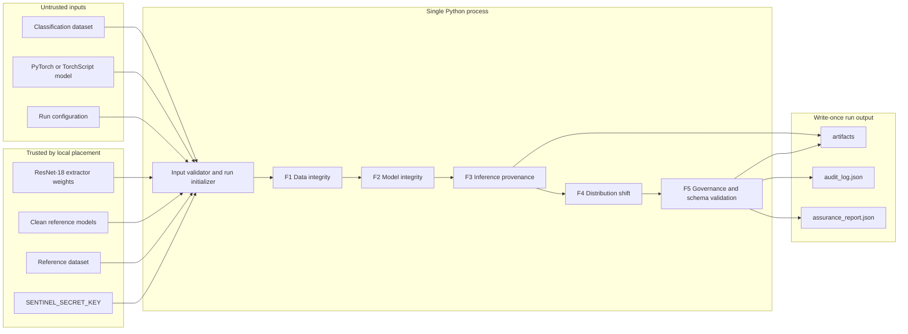

# Sentinel Phase 2 - Technical Requirements Document

**Document ID:** SENTINEL-P2-TRD  
**Version:** 1.0  
**Architecture class:** Single-process offline prototype  
**Target:** Windows 10/11, x86-64, Python 3.10  
**Authoritative root:** `D:\SIH`

## 1. Architecture

### 1.1 System context

Sentinel is a local CLI process. It receives operator-selected untrusted assets and locally placed trusted-by-configuration reference assets. It performs no network communication and exposes no server or frontend interface.

Normal assurance is read-only with respect to submitted datasets and models and requires no retraining. Contributor identities, when supplied as `source_id`, support source-level evidence aggregation but confer no privileged trust status.



### 1.2 Deliberate simplifications

There is no message bus, database, scheduler, REST service, or inter-process boundary. Engines are Python classes called sequentially by `pipeline.py`. NumPy, SciPy, scikit-learn, Pillow, CleanLab, and PyTorch may execute compiled native kernels internally; this does not create a project-owned C/C++ component.

This design favors delivery and inspectability over containment. A crash terminates the run, and a malicious model loaded through unsafe serialization may compromise the whole process. Those risks are accepted and disclosed for this prototype.

## 2. Component Responsibilities

| Component | Responsibility | Inputs | Outputs |
|---|---|---|---|
| `pipeline.py` | CLI, validation, state sequencing, staging/finalization | Paths and config | Final run or structured failure |
| `DataIntegrityModule` | Labels, duplicates, outliers, source aggregation | Dataset, embeddings, metadata | Findings and source records |
| `ModelIntegrityModule` | Architecture-matched weight-spectrum assessment | Candidate and clean references | Model status, score, evidence |
| `InferenceProvenanceModule` | Inference binding, ledger append, verification | Input/model/config/output/key | Protected or unsigned records |
| `DistributionShiftModule` | OOD distance and entropy-ratio assessment | Reference/incoming data and model | Sample and batch shift results |
| `GovernanceModule` | Normalize, disposition, coverage, serialization | All module results | Report and audit log |
| `EmbeddingExtractor` | Deterministic ResNet-18 embeddings and cache | Images and extractor artifact | Float32 embedding matrix |
| `HashingUtilities` | SHA-256, HMAC, canonical JSON | Bytes/objects/key | Digests and MACs |

## 3. Technology Stack and Rationale

| Layer | Selected technology | Rationale |
|---|---|---|
| Runtime | Python 3.10 | Compatible with governing prototype and ML ecosystem |
| Model execution | PyTorch and TorchScript | Required Phase 2 formats; offline-capable |
| Embeddings | torchvision ResNet-18 | Frozen, reproducible feature extractor |
| Label analysis | CleanLab + scikit-learn logistic regression | Out-of-fold label-quality analysis without modifying submitted model |
| Numeric processing | NumPy/SciPy | SVD, distance computation, canonical array handling |
| Anomaly models | scikit-learn | Isolation Forest and Ledoit-Wolf covariance |
| Image processing | Pillow + imagehash | Controlled decoding and 64-bit pHash |
| Cryptography | Python `hashlib`, `hmac`, `secrets` | Standard-library SHA-256/HMAC; no runtime services |
| Schemas | JSON Schema Draft 2020-12 + `jsonschema` | Formal, offline validation |
| CLI | `argparse` | No extra runtime dependency required |
| Storage | JSON, NPY, NPZ, filesystem directories | Adequate for single-process prototype |

Every dependency shall be pinned and downloaded into a local wheel directory on a connected staging machine. The extractor weights and benchmark datasets/models are artifacts, not runtime downloads.

## 4. Input Contracts

### 4.1 Dataset manifest

The normalized dataset manifest contains one row per occurrence, even if two rows reference byte-identical images:

```text
sample_id: non-empty unique string
image_path: normalized path under an allowed dataset root
label: integer in [0, num_classes)
source_id: optional string; normalized to "unknown" when absent
batch_id: optional string or null
```

The loader rejects duplicate `sample_id` values, missing images, images exceeding configured pixel/byte limits, inconsistent label cardinality, non-integer labels, and paths escaping configured roots.

### 4.2 Model contract

The model adapter returns:

```text
format: pytorch | torchscript | onnx_deferred
architecture_id: resnet18 | vgg16 | unknown
model_path: normalized absolute path
model_digest: SHA-256 over whole file
num_classes: positive integer
access_level: white_box | black_box
forward(input_batch) -> float32 logits [batch, num_classes]
state_dict() -> ordered tensor map, when white_box
```

These are wire-format values. Python enum member names may be uppercase internally, but every serialized JSON value uses the lowercase spelling defined by the Backend Schema.

TorchScript uses `torch.jit.load`. State-dict models are instantiated from an allowlisted architecture before loading weights. Loading arbitrary full-model pickle objects is permitted only behind an explicit unsafe flag and must create a coverage warning.

### 4.3 Run configuration

Configuration shall explicitly define input roots, dataset manifest, candidate model, model format/architecture, reference dataset, reference model directory, extractor weights, inference subset, class count, output root, detector thresholds, resource limits, and deterministic seed. Missing defaults are resolved before hashing; the fully materialized configuration is the only configuration representation used by F3.

## 5. Algorithmic Requirements

### 5.1 Shared embedding pipeline

1. Decode image to RGB.
2. Resize to 224x224 using the configured torchvision interpolation.
3. Convert to float32 `[0,1]` tensor.
4. Normalize using ImageNet channel means and standard deviations.
5. Run frozen ResNet-18 through the global-average-pool layer.
6. Flatten to a 512-element float32 vector.
7. Persist a cache only after binding it to image SHA-256, extractor SHA-256, preprocessing digest, and code/config version.

Cache mismatches cause recomputation. Cached embeddings are optimization artifacts, never authoritative evidence.

### 5.2 Label-error analysis

The five-fold pipeline prevents preprocessing leakage: each fold fits its scaler and logistic regression only on four folds, then predicts probabilities for the held-out fold. The assembled probability matrix has exactly one out-of-fold prediction per sample and is passed with noisy labels to CleanLab.

The label finding uses:

```text
raw_score = label_quality q
confidence = clamp(1 - q, 0, 1)
calibration_status = uncalibrated
```

The report shall not call this confidence a calibrated probability.

### 5.3 Duplicate detection

pHash matching uses 64-bit Hamming distance. Embedding matching performs top-10 cosine-neighbor search in bounded query chunks; self-neighbors are discarded. The implementation shall not construct a full `N x N` matrix. Each undirected pair is emitted once using a canonical `(min(sample_id), max(sample_id))` key.

Normalizer definitions:

```text
phash finding, d <= 8:
    confidence = 0.70 + 0.30 * (8 - d) / 8

cosine finding, s >= 0.95:
    confidence = 0.70 + 0.30 * (s - 0.95) / 0.05

combined pair confidence = clamp(max(component confidences), 0, 1)
```

Connected components form duplicate clusters. The report retains all pair evidence rather than treating transitive similarity as direct equality.

### 5.4 Isolation Forest

Isolation Forest shall use a deterministic seed. Its contamination setting and finding percentile shall be configuration fields. For sample adverse score `a = -score_samples(x)`:

```text
confidence = empirical_percentile(a within assessed dataset)
finding emitted when confidence >= configured outlier percentile, default 0.95
```

### 5.5 Weight-spectral analysis

Candidate and reference state dictionaries must have equal analyzed tensor key sets and shapes. Each eligible tensor is converted to a finite float64 matrix for SVD. Non-finite tensors cause a separate critical model finding.

For singular values `s`, normalized spectrum is `s / max(sum(s), epsilon)`. An element-wise median spectrum is possible because exact architecture matching guarantees equal vector lengths. First Wasserstein distance is calculated per layer using singular-value magnitudes as samples. The candidate model score is the NumPy-compatible 95th percentile of layer distances.

For each clean reference `r_i`, its leave-one-out score is calculated against the median spectra of all other references. The candidate threshold is:

```text
T = nextafter(max(LOO_scores), +infinity)
```

No adverse finding is emitted for `D <= T`. For `D > T`:

```text
excess_ratio = (D - T) / max(T, epsilon)
confidence = clamp(0.70 + 0.30 * min(excess_ratio, 1), 0, 1)
```

This is an uncalibrated anomaly-strength mapping. VGG-16 smoke testing verifies loader/layer compatibility only.

### 5.6 Mahalanobis OOD

Ledoit-Wolf is fit globally to finite reference embeddings. Reference Mahalanobis distances establish an empirical CDF and default 95th-percentile threshold. An incoming sample's confidence is its empirical percentile against reference distances. A finding is emitted only above the configured percentile.

### 5.7 Predictive entropy ratio

Given logits `z`, probabilities use numerically stable softmax, and entropy is:

```text
p = softmax(z)
H(p) = -sum(p_i * log(max(p_i, epsilon)))
R = mean(H_incoming) / max(mean(H_reference), epsilon)
```

For `R >= 1.3`, Sentinel emits `possible_drift` with fixed `REVIEW` because intent is unknown. For `R <= 0.7`, adverse confidence is:

```text
confidence = clamp(0.70 + 0.30 * (0.7 - R) / 0.7, 0, 1)
```

Values inside `(0.7, 1.3)` produce `INCONCLUSIVE` characterization without an adverse finding. These thresholds are heuristics, not calibrated physical-cause attribution.

## 6. Cryptographic Design

### 6.1 Threat objective

The mechanism detects modification of protected record fields, internal deletion/reordering, and mismatches between retained artifacts and their recorded digests, provided the HMAC key and verifier are not compromised. It authenticates neither the operator nor the truthfulness of the original inference.

### 6.2 Primitive and key

- Hash: SHA-256.
- MAC: HMAC-SHA256.
- Environment value: exactly 64 hexadecimal characters.
- Runtime key: `bytes.fromhex(value)`, exactly 32 bytes.
- Comparisons: `hmac.compare_digest`.
- Key values: never serialized or included in exception text.

### 6.3 Binding construction

Component representations are:

```text
input_hash  = sha256(original encoded image bytes).hexdigest()
model_hash  = sha256(whole model file bytes).hexdigest()
config_hash = sha256(canonical materialized config JSON).hexdigest()
output_hash = sha256(float32 little-endian C-contiguous output bytes).hexdigest()
```

The MAC message is:

```text
UTF8("binding|" + input_hash + "|" + model_hash + "|" +
     config_hash + "|" + output_hash)
```

### 6.4 Entry construction

Canonical JSON is `json.dumps(value, sort_keys=True, separators=(",", ":"), ensure_ascii=False, allow_nan=False).encode("utf-8")`.

For entry dictionary `e` without `entry_hmac`:

```text
entry_hmac = HMAC-SHA256(key, b"ledger|" + canonical_json(e)).hexdigest()
full_entry = e plus entry_hmac
entry_hash = SHA256(canonical_json(full_entry)).hexdigest()
```

The next entry's `previous_entry_hash` equals `entry_hash`. Genesis uses 64 zeroes. Sequence numbers start at 1 and increase by exactly one within a run.

### 6.5 Verification order

1. Validate record schema and finite values.
2. Validate sequence continuity and predecessor links.
3. Recompute `entry_hmac` and compare in constant time.
4. For inference entries, resolve evidence references under allowed roots.
5. Recompute input, model, config, and output hashes.
6. Recompute `binding_hmac` and compare in constant time.
7. Return all detected failures without treating one failure as proof that remaining fields are valid.

### 6.6 Fail-open path

If key validation, HMAC generation, evidence persistence, or protected append fails, inference output is returned with `UNSIGNED`. An unprotected diagnostic record may be emitted separately. Governance creates a fixed `REVIEW` finding and declares that the failure itself is not protected by the ledger.

## 7. Storage and Atomicity

### 7.1 Run layout

```text
D:\SIH\sentinel\output\runs\<report_id>\
|-- assurance_report.json
|-- audit_log.json
|-- coverage_statement.json
|-- run_manifest.json
`-- artifacts\
    |-- inputs\
    |-- configs\
    `-- outputs\
```

Model files are not copied. `run_manifest.json` records their normalized path and digest.

### 7.2 Finalization protocol

1. Create `output\staging\<report_id>.partial` exclusively.
2. Copy evidence without following symbolic links or reparse points outside allowed roots.
3. Write NPY evidence plus the coverage statement, assurance report, and a preliminary authenticated audit log using temporary sibling names.
4. Build `run_manifest.json` over every retained artifact except `audit_log.json`; include the report and coverage digests and the external model path/digest.
5. Append the authenticated `run_finalized` audit entry whose payload includes the finalized manifest digest and report digest, then atomically replace the preliminary audit log.
6. Flush and close every file, reopen them, validate all JSON schemas, recompute every manifest digest, and verify the complete HMAC chain.
7. Refuse finalization if `output\runs\<report_id>` already exists.
8. Rename the staging directory atomically to `output\runs\<report_id>` on the same volume.

The manifest excludes the audit log to prevent a circular self-commitment; the audit log commits the manifest, and the verifier authenticates the audit log directly. A crash before step 8 leaves a partial directory that is never presented as a completed run.

## 8. Security Constraints and Limitations

### 8.1 Accepted trust assumptions

- The Windows host, Python runtime, installed packages, current Sentinel code, operator, and configured reference directories are trusted.
- The HMAC key remains secret and is available to the process.
- Files read during a synchronous hash/copy operation do not change concurrently.

### 8.2 Untrusted assets

- Submitted dataset bytes, labels, source metadata, and model are untrusted.
- Model parsing is an acknowledged code-execution risk where pickle loading is enabled.
- Resource-exhaustion attacks are only bounded by configured file, pixel, sample, and runtime limits.

### 8.3 Unsupported guarantees

- No protection against host administrators, compromised Sentinel code/process, key holders, malicious reference assets, rollback of the entire run directory, or replacement of the verifier.
- No trusted time or cross-run monotonic state.
- No proof of non-existence or tail completeness without an expected record count.
- No confidentiality or encryption at rest.
- No cryptographic attribution to a human or node identity.

## 9. Performance Requirements

Performance values are engineering expectations, not release-blocking SLOs unless separately stated.

| Workload | Reference expectation |
|---|---:|
| Full CIFAR-10 F1 scan | <30 minutes CPU |
| Candidate F2 analysis | <60 seconds after references cached |
| F3 record generation | <10 ms excluding model inference and file copying |
| F4 score after embeddings/logits exist | <100 ms per sample |
| End-to-end run | <1 hour |
| Peak application RAM | <8 GB |
| Prototype-owned storage | <=2 GB, excluding operator data/models |

The k-NN implementation must process query chunks and retain only top-k neighbors. Embeddings and reference spectra may be cached. Timing reports must separate cold extraction, cached analysis, model inference, evidence copying, and serialization.

## 10. Failure Semantics

| Condition | Required behavior |
|---|---|
| Invalid primary input | Fail run before detectors |
| Missing F1 reference/extractor | F1 affected method `UNAVAILABLE` |
| Black-box model | F2 `UNAVAILABLE` |
| Insufficient F2 references | F2 `UNAVAILABLE` |
| Detector exception | Record `engine_error`; continue only if safe |
| Missing HMAC key | Generate inference result as `UNSIGNED`; force REVIEW |
| Audit append failure | Preserve result as `UNSIGNED`; force REVIEW |
| Missing verification artifact | Verification `UNAVAILABLE` for that component |
| Digest mismatch | `TAMPERED`, critical |
| All applicable modules unavailable | Overall `INCONCLUSIVE` |
| Schema-invalid output | Do not finalize run |

## 11. Offline Packaging

On a connected staging system, build a wheelhouse for Windows x86-64 using pinned versions and download all required datasets, extractor weights, and test artifacts separately. Generate a SHA-256 manifest for the transfer package. On the air-gapped system, install only with `pip --no-index --find-links`. The manifest provides transfer-integrity checking but is not authenticated in Phase 2.

Normal application code shall not import HTTP clients for runtime artifact resolution, invoke model hubs, enable telemetry, or perform update checks.

## 12. Technical Acceptance

The technical release gate requires:

- deterministic unit tests for canonicalization, MACs, chain mutation, sequence deletion/reordering, and tail-truncation limitation;
- successful schema validation of every finalized artifact;
- clean/poison benchmark gates and demonstration-scale labeling;
- exact architecture rejection for mismatched reference models;
- no false clean disposition for unavailable checks;
- no network access during a representative air-gapped run; and
- preservation of raw score, threshold, confidence normalizer identifier, calibration status, and method version for every finding.
