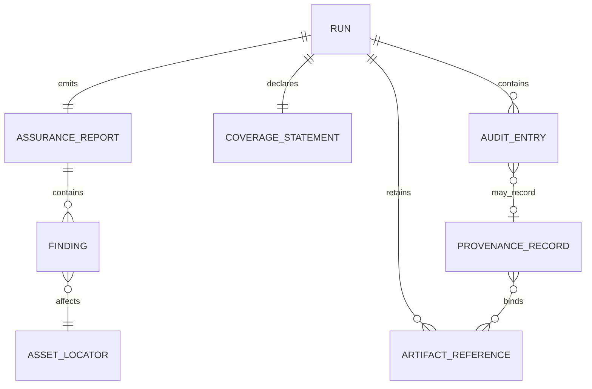

# Sentinel Phase 2 - Backend Schema and Data Contracts

**Document ID:** SENTINEL-P2-SCHEMA  
**Version:** 1.0  
**Schema dialect:** JSON Schema Draft 2020-12  
**Persistence:** Filesystem artifacts; no database in Phase 2

## 1. Persistence Decision

Phase 2 deliberately has no SQLite or server database. Runtime entities are Python dataclasses and lists. A completed run is serialized into an application-level write-once directory:

```text
D:\SIH\sentinel\output\runs\<report_id>\
|-- assurance_report.json
|-- audit_log.json
|-- coverage_statement.json
|-- run_manifest.json
`-- artifacts\
    |-- inputs\
    |-- configs\
    `-- outputs\
```

The logical relationships are:



No file may be interpreted independently of its `schema_version` and `report_id`. All finalized JSON is UTF-8, compact or pretty-printed for storage as appropriate, and rejected if it contains `NaN`, `Infinity`, or `-Infinity`.

## 2. Common Types

| Type | Representation | Constraints |
|---|---|---|
| UUID | JSON string | RFC 4122 textual UUID |
| UTC timestamp | JSON string | RFC 3339/ISO 8601 with `Z` or explicit UTC offset |
| SHA-256 | JSON string | 64 lowercase hexadecimal characters |
| HMAC-SHA256 | JSON string | 64 lowercase hexadecimal characters |
| Confidence | JSON number | `[0,1]`, finite, `calibration_status="uncalibrated"` |
| Sequence | JSON integer | starts at 1, strictly increments by 1 within a run |
| Relative artifact path | JSON string | relative to run directory; no `..`, drive, or absolute prefix |
| External model path | JSON string | normalized Windows absolute path plus separately stored digest |

## 3. Canonical Finding Contract

```json
{
  "$schema": "https://json-schema.org/draft/2020-12/schema",
  "$id": "https://sentinel.local/schemas/finding.schema.json",
  "title": "SentinelFinding",
  "type": "object",
  "additionalProperties": false,
  "required": [
    "finding_id", "finding_type", "pillar", "affected_asset",
    "severity", "raw_score", "decision_threshold", "confidence",
    "confidence_normalizer", "calibration_status", "human_readable_reason",
    "evidence", "method", "recommended_disposition"
  ],
  "properties": {
    "finding_id": { "type": "string", "format": "uuid" },
    "finding_type": {
      "type": "string",
      "enum": [
        "label_error", "near_duplicate", "statistical_outlier",
        "source_concentration", "weight_spectral_anomaly", "non_finite_weight",
        "provenance_tampered", "provenance_reordered", "provenance_deleted",
        "provenance_unsigned", "ood_sample", "possible_drift",
        "suspicious_entropy_shift", "engine_error", "malformed_input"
      ]
    },
    "pillar": { "type": "string", "enum": ["F1", "F2", "F3", "F4", "F5"] },
    "affected_asset": {
      "type": "object",
      "additionalProperties": false,
      "required": ["asset_type", "asset_id"],
      "properties": {
        "asset_type": {
          "type": "string",
          "enum": ["sample", "duplicate_cluster", "source", "dataset", "model", "inference_record", "inference_batch", "run"]
        },
        "asset_id": { "type": "string", "minLength": 1 },
        "sample_ids": { "type": "array", "items": { "type": "string" }, "uniqueItems": true },
        "source_id": { "type": ["string", "null"] },
        "layer_name": { "type": ["string", "null"] },
        "artifact_ref": { "$ref": "#/$defs/relativePath" }
      }
    },
    "severity": { "type": "string", "enum": ["informational", "low", "medium", "high", "critical"] },
    "raw_score": { "type": ["number", "integer", "null"] },
    "decision_threshold": { "type": ["number", "integer", "string", "null"] },
    "confidence": { "type": "number", "minimum": 0, "maximum": 1 },
    "confidence_normalizer": { "type": "string", "minLength": 1 },
    "calibration_status": { "const": "uncalibrated" },
    "human_readable_reason": { "type": "string", "minLength": 1 },
    "evidence": { "type": "object", "additionalProperties": true },
    "method": {
      "type": "object",
      "additionalProperties": false,
      "required": ["name", "version"],
      "properties": {
        "name": { "type": "string", "minLength": 1 },
        "version": { "type": "string", "minLength": 1 },
        "parameters_digest": { "$ref": "#/$defs/sha256" }
      }
    },
    "recommended_disposition": { "type": "string", "enum": ["accept", "review", "quarantine"] }
  },
  "$defs": {
    "sha256": { "type": "string", "pattern": "^[0-9a-f]{64}$" },
    "relativePath": {
      "type": ["string", "null"],
      "pattern": "^(?![A-Za-z]:)(?![/\\\\])(?!.*(?:^|[/\\\\])\\.\\.(?:[/\\\\]|$)).+$"
    }
  }
}
```

Policy-generated findings such as `provenance_unsigned` and `source_concentration` still contain a confidence field for schema uniformity, but their `recommended_disposition` is governed by the explicit policy recorded in `confidence_normalizer`, not by generic thresholds.

## 4. Assurance Report Schema

```json
{
  "$schema": "https://json-schema.org/draft/2020-12/schema",
  "$id": "https://sentinel.local/schemas/assurance-report.schema.json",
  "title": "SentinelAssuranceReport",
  "type": "object",
  "additionalProperties": false,
  "required": [
    "schema_version", "report_id", "run_timestamp", "framework_version",
    "execution", "assets", "module_assessments", "findings",
    "overall_disposition", "disposition_trace", "coverage_statement_ref",
    "audit_log_ref", "run_manifest_ref"
  ],
  "properties": {
    "schema_version": { "const": "1.0" },
    "report_id": { "type": "string", "format": "uuid" },
    "run_timestamp": { "type": "string", "format": "date-time" },
    "framework_version": { "type": "string", "minLength": 1 },
    "execution": {
      "type": "object",
      "additionalProperties": false,
      "required": ["offline", "platform", "python_version", "seed", "run_status"],
      "properties": {
        "offline": { "const": true },
        "platform": { "const": "windows-x86_64" },
        "python_version": { "type": "string" },
        "seed": { "type": "integer" },
        "run_status": { "const": "completed" },
        "started_at": { "type": "string", "format": "date-time" },
        "completed_at": { "type": "string", "format": "date-time" }
      }
    },
    "assets": {
      "type": "object",
      "additionalProperties": false,
      "required": ["dataset", "model", "references"],
      "properties": {
        "dataset": { "$ref": "#/$defs/digestedAsset" },
        "model": { "$ref": "#/$defs/externalModel" },
        "references": {
          "type": "array",
          "items": { "$ref": "#/$defs/digestedAsset" }
        }
      }
    },
    "module_assessments": {
      "type": "object",
      "additionalProperties": false,
      "required": ["F1", "F2", "F3", "F4", "F5"],
      "properties": {
        "F1": { "$ref": "#/$defs/moduleAssessment" },
        "F2": { "$ref": "#/$defs/moduleAssessment" },
        "F3": { "$ref": "#/$defs/moduleAssessment" },
        "F4": { "$ref": "#/$defs/moduleAssessment" },
        "F5": { "$ref": "#/$defs/moduleAssessment" }
      }
    },
    "findings": {
      "type": "array",
      "items": { "$ref": "https://sentinel.local/schemas/finding.schema.json" }
    },
    "source_assessments": {
      "type": "array",
      "items": { "$ref": "#/$defs/sourceAssessment" }
    },
    "shift_assessment": { "type": ["object", "null"], "additionalProperties": true },
    "overall_disposition": {
      "type": "string",
      "enum": ["accept", "review", "quarantine", "inconclusive"]
    },
    "disposition_trace": {
      "type": "object",
      "additionalProperties": false,
      "required": ["policy", "contributing_finding_ids", "explanation"],
      "properties": {
        "policy": { "const": "maximum_disposition_v1" },
        "contributing_finding_ids": {
          "type": "array",
          "items": { "type": "string", "format": "uuid" },
          "uniqueItems": true
        },
        "explanation": { "type": "string", "minLength": 1 }
      }
    },
    "coverage_statement_ref": { "$ref": "#/$defs/relativePath" },
    "audit_log_ref": { "$ref": "#/$defs/relativePath" },
    "run_manifest_ref": { "$ref": "#/$defs/relativePath" }
  },
  "$defs": {
    "sha256": { "type": "string", "pattern": "^[0-9a-f]{64}$" },
    "relativePath": {
      "type": "string",
      "pattern": "^(?![A-Za-z]:)(?![/\\\\])(?!.*(?:^|[/\\\\])\\.\\.(?:[/\\\\]|$)).+$"
    },
    "digestedAsset": {
      "type": "object",
      "additionalProperties": false,
      "required": ["asset_id", "asset_type", "digest"],
      "properties": {
        "asset_id": { "type": "string", "minLength": 1 },
        "asset_type": { "type": "string" },
        "digest": { "$ref": "#/$defs/sha256" },
        "artifact_ref": { "$ref": "#/$defs/relativePath" }
      }
    },
    "externalModel": {
      "type": "object",
      "additionalProperties": false,
      "required": ["asset_id", "asset_type", "digest", "external_path", "format", "architecture_id"],
      "properties": {
        "asset_id": { "type": "string", "minLength": 1 },
        "asset_type": { "const": "model" },
        "digest": { "$ref": "#/$defs/sha256" },
        "external_path": { "type": "string", "pattern": "^[A-Za-z]:\\\\" },
        "format": { "type": "string", "enum": ["pytorch", "torchscript"] },
        "architecture_id": { "type": "string", "enum": ["resnet18", "vgg16", "unknown"] }
      }
    },
    "moduleAssessment": {
      "type": "object",
      "additionalProperties": false,
      "required": ["status", "finding_count", "methods_executed", "methods_unavailable"],
      "properties": {
        "status": { "type": "string", "enum": ["completed", "partial", "unavailable", "failed"] },
        "finding_count": { "type": "integer", "minimum": 0 },
        "methods_executed": { "type": "array", "items": { "type": "string" }, "uniqueItems": true },
        "methods_unavailable": {
          "type": "array",
          "items": {
            "type": "object",
            "additionalProperties": false,
            "required": ["method", "reason"],
            "properties": {
              "method": { "type": "string" },
              "reason": { "type": "string" }
            }
          }
        }
      }
    },
    "sourceAssessment": {
      "type": "object",
      "additionalProperties": false,
      "required": ["source_id", "sample_count", "anomaly_count", "anomaly_rate", "concentration_status", "disposition"],
      "properties": {
        "source_id": { "type": "string" },
        "sample_count": { "type": "integer", "minimum": 0 },
        "anomaly_count": { "type": "integer", "minimum": 0 },
        "anomaly_rate": { "type": "number", "minimum": 0, "maximum": 1 },
        "concentration_status": { "type": "string", "enum": ["completed", "unavailable"] },
        "p_value": { "type": ["number", "null"], "minimum": 0, "maximum": 1 },
        "dataset_rate_multiplier": { "type": ["number", "null"], "minimum": 0 },
        "disposition": { "type": "string", "enum": ["accept", "review", "quarantine"] }
      }
    }
  }
}
```

## 5. Inference Provenance Payload Schema

```json
{
  "$schema": "https://json-schema.org/draft/2020-12/schema",
  "$id": "https://sentinel.local/schemas/inference-provenance.schema.json",
  "title": "SentinelInferenceProvenanceRecord",
  "type": "object",
  "additionalProperties": false,
  "required": [
    "record_id", "sequence_number", "timestamp", "status",
    "input_ref", "input_hash", "model_path", "model_hash",
    "config_ref", "config_hash", "output_ref", "output_hash",
    "output_contract", "binding_hmac"
  ],
  "properties": {
    "record_id": { "type": "string", "format": "uuid" },
    "sequence_number": { "type": "integer", "minimum": 1 },
    "timestamp": { "type": "string", "format": "date-time" },
    "status": { "type": "string", "enum": ["signed", "unsigned"] },
    "input_ref": { "$ref": "#/$defs/relativePath" },
    "input_hash": { "$ref": "#/$defs/sha256" },
    "model_path": { "type": "string", "pattern": "^[A-Za-z]:\\\\" },
    "model_hash": { "$ref": "#/$defs/sha256" },
    "config_ref": { "$ref": "#/$defs/relativePath" },
    "config_hash": { "$ref": "#/$defs/sha256" },
    "output_ref": { "$ref": "#/$defs/relativePath" },
    "output_hash": { "$ref": "#/$defs/sha256" },
    "output_contract": {
      "type": "object",
      "additionalProperties": false,
      "required": ["dtype", "byte_order", "layout", "shape"],
      "properties": {
        "dtype": { "const": "float32" },
        "byte_order": { "const": "little" },
        "layout": { "const": "C" },
        "shape": {
          "type": "array",
          "minItems": 1,
          "maxItems": 1,
          "items": { "type": "integer", "minimum": 1 }
        }
      }
    },
    "binding_hmac": { "type": ["string", "null"], "pattern": "^[0-9a-f]{64}$" },
    "failure_reason": { "type": ["string", "null"] }
  },
  "allOf": [
    {
      "if": { "properties": { "status": { "const": "signed" } } },
      "then": {
        "properties": {
          "binding_hmac": { "type": "string", "pattern": "^[0-9a-f]{64}$" }
        }
      },
      "else": {
        "properties": { "binding_hmac": { "type": "null" } },
        "required": ["failure_reason"]
      }
    }
  ],
  "$defs": {
    "sha256": { "type": "string", "pattern": "^[0-9a-f]{64}$" },
    "relativePath": {
      "type": "string",
      "pattern": "^(?![A-Za-z]:)(?![/\\\\])(?!.*(?:^|[/\\\\])\\.\\.(?:[/\\\\]|$)).+$"
    }
  }
}
```

The schema permits `binding_hmac=null` only for an unsigned record. An unsigned record is not inserted into the authenticated chain as though it were protected; its existence is carried into governance through a `provenance_unsigned` finding and may also appear in an unprotected diagnostic artifact.

## 6. Audit Log Schema

`audit_log.json` is an array ordered by `sequence_number`.

```json
{
  "$schema": "https://json-schema.org/draft/2020-12/schema",
  "$id": "https://sentinel.local/schemas/audit-log.schema.json",
  "title": "SentinelAuditLog",
  "type": "array",
  "items": {
    "type": "object",
    "additionalProperties": false,
    "required": [
      "entry_id", "sequence_number", "timestamp", "action", "actor",
      "status", "payload", "previous_entry_hash", "entry_hmac"
    ],
    "properties": {
      "entry_id": { "type": "string", "format": "uuid" },
      "sequence_number": { "type": "integer", "minimum": 1 },
      "timestamp": { "type": "string", "format": "date-time" },
      "action": {
        "type": "string",
        "enum": [
          "run_started", "module_started", "module_completed", "module_unavailable",
          "finding_recorded", "inference_signed", "verification_completed",
          "disposition_computed", "report_validated", "run_finalized"
        ]
      },
      "actor": { "const": "sentinel-phase2" },
      "status": { "type": "string", "enum": ["success", "partial", "unavailable", "failed"] },
      "payload": { "type": "object", "additionalProperties": true },
      "previous_entry_hash": { "type": "string", "pattern": "^[0-9a-f]{64}$" },
      "entry_hmac": { "type": "string", "pattern": "^[0-9a-f]{64}$" }
    }
  }
}
```

Cross-entry invariants not expressible in JSON Schema are mandatory verifier checks:

- array order equals sequence order;
- first sequence is 1;
- every next sequence is previous plus 1;
- genesis predecessor is 64 zeroes;
- every other predecessor equals SHA-256 of the prior canonical full entry;
- every `entry_hmac` verifies under the configured key.

## 7. Coverage Statement Contract

```json
{
  "$schema": "https://json-schema.org/draft/2020-12/schema",
  "$id": "https://sentinel.local/schemas/coverage-statement.schema.json",
  "title": "SentinelCoverageStatement",
  "type": "object",
  "additionalProperties": false,
  "required": [
    "schema_version", "report_id", "implemented_checks", "executed_checks",
    "unavailable_checks", "supported_attack_classes", "unsupported_attack_classes",
    "trust_assumptions", "security_limitations", "validation_scope"
  ],
  "properties": {
    "schema_version": { "const": "1.0" },
    "report_id": { "type": "string", "format": "uuid" },
    "implemented_checks": { "$ref": "#/$defs/uniqueStrings" },
    "executed_checks": { "$ref": "#/$defs/uniqueStrings" },
    "unavailable_checks": {
      "type": "array",
      "items": {
        "type": "object",
        "additionalProperties": false,
        "required": ["name", "reason"],
        "properties": {
          "name": { "type": "string", "minLength": 1 },
          "reason": { "type": "string", "minLength": 1 }
        }
      }
    },
    "supported_attack_classes": { "$ref": "#/$defs/uniqueStrings" },
    "unsupported_attack_classes": { "$ref": "#/$defs/uniqueStrings" },
    "trust_assumptions": { "$ref": "#/$defs/uniqueStrings" },
    "security_limitations": { "$ref": "#/$defs/uniqueStrings" },
    "validation_scope": {
      "type": "object",
      "additionalProperties": false,
      "required": ["dataset", "architectures", "sample_sizes", "seeds", "status"],
      "properties": {
        "dataset": { "type": "string", "minLength": 1 },
        "architectures": { "$ref": "#/$defs/uniqueStrings" },
        "sample_sizes": {
          "type": "object",
          "additionalProperties": { "type": "integer", "minimum": 0 }
        },
        "seeds": { "type": "array", "items": { "type": "integer" }, "uniqueItems": true },
        "status": { "type": "string", "enum": ["not_run", "passed", "failed", "partial"] },
        "metrics_ref": { "type": ["string", "null"] }
      }
    }
  },
  "$defs": {
    "uniqueStrings": {
      "type": "array",
      "items": { "type": "string", "minLength": 1 },
      "uniqueItems": true
    }
  }
}
```

Required unsupported entries include trigger discovery, black-box fingerprinting, bbox tampering, architectural backdoors, laundering/distillation, adversarial patches, semantic-cause attribution, blended/physical triggers, federated poisoning, hardware compromise, cross-session replay, host compromise, and tail truncation without an independent expected length.

## 8. Run Manifest Contract

`run_manifest.json` is the inventory used to distinguish missing evidence from modified evidence. It intentionally excludes `audit_log.json` to avoid a circular commitment: the final audit entry commits to this manifest's digest.

```json
{
  "$schema": "https://json-schema.org/draft/2020-12/schema",
  "$id": "https://sentinel.local/schemas/run-manifest.schema.json",
  "title": "SentinelRunManifest",
  "type": "object",
  "additionalProperties": false,
  "required": ["schema_version", "report_id", "created_at", "artifacts"],
  "properties": {
    "schema_version": { "const": "1.0" },
    "report_id": { "type": "string", "format": "uuid" },
    "created_at": { "type": "string", "format": "date-time" },
    "artifacts": {
      "type": "array",
      "items": {
        "type": "object",
        "additionalProperties": false,
        "required": ["artifact_id", "role", "storage", "path", "sha256", "size_bytes", "media_type", "created_at"],
        "properties": {
          "artifact_id": { "type": "string", "format": "uuid" },
          "role": { "type": "string", "enum": ["input", "model", "config", "output", "report", "coverage", "cache"] },
          "storage": { "type": "string", "enum": ["copied", "external"] },
          "path": { "type": "string", "minLength": 1 },
          "sha256": { "type": "string", "pattern": "^[0-9a-f]{64}$" },
          "size_bytes": { "type": "integer", "minimum": 0 },
          "media_type": { "type": "string", "minLength": 1 },
          "created_at": { "type": "string", "format": "date-time" }
        },
        "allOf": [
          {
            "if": { "properties": { "storage": { "const": "copied" } }, "required": ["storage"] },
            "then": {
              "properties": {
                "path": {
                  "pattern": "^(?![A-Za-z]:)(?![/\\\\])(?!.*(?:^|[/\\\\])\\.\\.(?:[/\\\\]|$)).+$"
                }
              }
            },
            "else": {
              "properties": {
                "path": { "pattern": "^[A-Za-z]:\\\\" },
                "role": { "const": "model" }
              }
            }
          }
        ]
      }
    }
  }
}
```

The manifest itself is referenced by the final authenticated `run_finalized` audit entry. A later verifier reports:

- `VALID` when the artifact exists and its digest matches;
- `TAMPERED` when it exists and its digest differs;
- `UNAVAILABLE` when it no longer exists;
- `UNSUPPORTED` when the requested guarantee, such as tail completeness without an expected count, cannot be established.

## 9. Python Domain Model

The implementation shall mirror the schemas with typed dataclasses or validated typed models:

```python
@dataclass(frozen=True)
class Finding:
    finding_id: UUID
    finding_type: FindingType
    pillar: Pillar
    affected_asset: AssetLocator
    severity: Severity
    raw_score: float | int | None
    decision_threshold: float | int | str | None
    confidence: float
    confidence_normalizer: str
    calibration_status: Literal["uncalibrated"]
    human_readable_reason: str
    evidence: dict[str, JSONValue]
    method: MethodIdentity
    recommended_disposition: Disposition

@dataclass(frozen=True)
class ModuleAssessment:
    status: ModuleStatus
    findings: tuple[Finding, ...]
    methods_executed: tuple[str, ...]
    methods_unavailable: tuple[UnavailableMethod, ...]
```

Mutation occurs only while constructing a run. Final domain objects are frozen before serialization.
