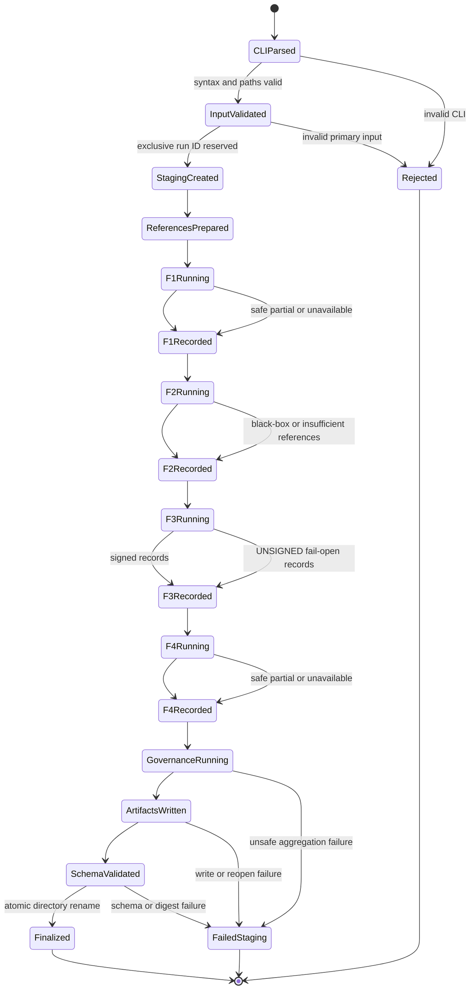
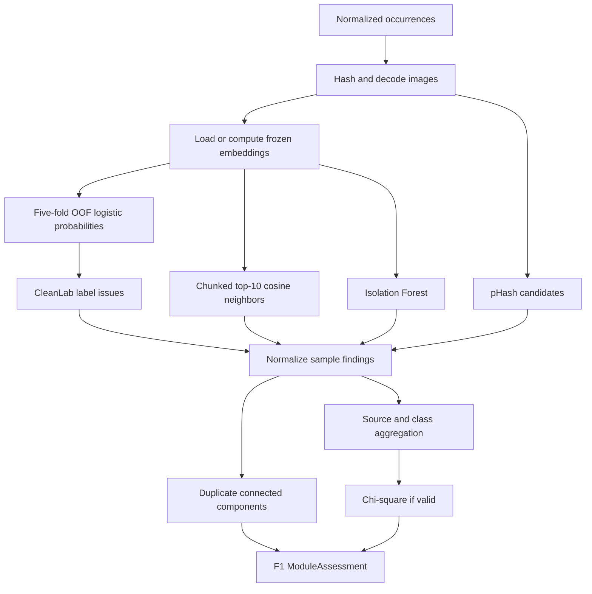
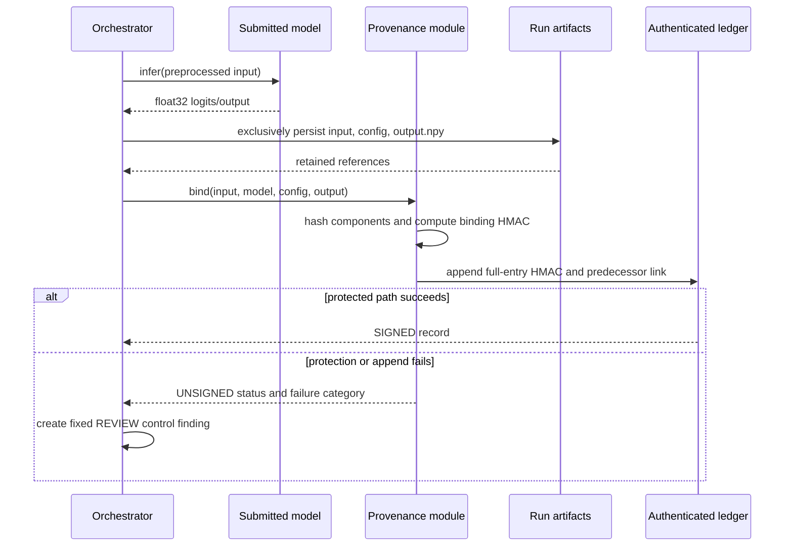
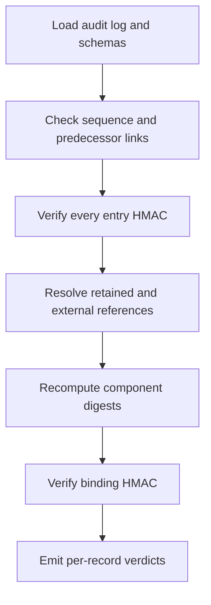

# Sentinel Phase 2 - Application Flow and System Orchestration

**Document ID:** SENTINEL-P2-FLOW  
**Version:** 1.0  
**Execution model:** One synchronous Python process; no IPC or message bus

## 1. Orchestration Invariant

One invocation produces at most one finalized run. The orchestrator owns all mutable state until finalization. Modules return typed results; they do not write final reports independently. Every safe module failure becomes an explicit result. Invalid primary inputs, unsafe state corruption, or schema-invalid outputs prevent finalization.

## 2. Top-Level State Machine



`Rejected` occurs before meaningful analysis. `FailedStaging` preserves diagnostic state under `output\staging` but is never presented as an assurance report.

## 3. Run Context

The orchestrator creates one in-memory `RunContext`:

```text
report_id
started_at
materialized_config
allowed_input_roots
staging_path
dataset_manifest and dataset_digest
candidate_model adapter/path/digest
reference asset identities
extractor identity and cache namespace
module assessments F1-F5
normalized findings
source assessments
provenance records
authenticated audit entries
unprotected diagnostics
```

The context is not globally mutable. Each stage receives the fields it needs and returns a new result that the orchestrator attaches after validation.

## 4. Detailed Flow

### 4.1 CLI parsing and materialization

Required CLI parameters identify the dataset manifest/root, candidate model, architecture/format, reference dataset, reference models, local embedding backbone, inference subset, configuration, and output root. Optional values are resolved into explicit defaults before the configuration is hashed.

The CLI must never accept the HMAC key as a command-line argument. The key is read from `SENTINEL_SECRET_KEY` so it does not appear in normal process arguments or generated command history.

### 4.2 Input validation

Validation order is security-sensitive:

1. Normalize paths without opening untrusted content.
2. Confirm allowed-root containment and reject traversal/reparse escapes.
3. Check file counts, extensions, byte limits, and model/reference presence.
4. Parse dataset metadata using bounded readers.
5. Validate unique sample identifiers, label types/ranges, and optional source fields.
6. Identify model adapter and declared access level.
7. Validate the output location and available space.
8. Validate the HMAC environment value without displaying it.

A malformed submitted dataset/model is not converted to `UNAVAILABLE`; malformed required input rejects the run. Missing optional/reference capability inputs make only the affected method unavailable.

### 4.3 Run initialization and ledger genesis

The orchestrator generates a UUID report ID, creates `output\staging\<report_id>.partial` exclusively, and writes a non-final diagnostic state marker. It initializes the authenticated audit chain with `previous_entry_hash = "0" * 64` and sequence 1.

If key parsing succeeds, a protected `run_started` entry is appended. If it fails, provenance and authenticated governance logging are unavailable; the run may continue only under the explicit fail-open policy, and the final result cannot be better than `REVIEW`.

### 4.4 Reference preparation

The reference stage:

- computes/validates the embedding-extractor digest;
- loads or computes reference embeddings;
- materializes the reference distribution identity;
- discovers same-architecture clean reference models;
- verifies state-dict key/shape compatibility; and
- records unavailable methods without presenting missing references as clean evidence.

References are trusted by placement. Their digests document what was used but do not authenticate origin.

### 4.5 F1 data assurance



The scaler and logistic-regression classifier are fitted inside each training fold. No held-out sample influences its own transformation or classifier. Duplicate pair generation excludes self-pairs and canonicalizes pair order before connected-component clustering.

For a source with anomalies but insufficient chi-square counts, `concentration_status` is unavailable while the source disposition is `REVIEW`. Absence of source metadata produces one `unknown` source and an attribution limitation.

### 4.6 F2 model assurance

1. If access is `black_box`, return `UNAVAILABLE` immediately.
2. Load the candidate using the declared, format-specific adapter.
3. Select clean references with exactly matching architecture and analyzed tensor keys/shapes.
4. For every reference and candidate, compute or load per-layer normalized spectra.
5. Calculate leave-one-out clean scores.
6. Set `T = nextafter(max(LOO), +infinity)`.
7. Calculate candidate layer distances and 95th-percentile model score `D`.
8. Emit no adverse finding when `D <= T`; emit `weight_spectral_anomaly` when `D > T`.
9. Preserve all layer distances, reference identities, `D`, `T`, normalizer version, and limitations.

A clean result means only that this custom heuristic did not exceed its demonstration-scale reference envelope. It is never phrased as proof that the model contains no backdoor.

### 4.7 F3 inference generation

For each selected inference input:



The result released by the prototype is the same output whose canonical bytes were persisted and hashed. Conversion to float32 little-endian C-contiguous form occurs once; inference consumers and hashing share that canonical array.

### 4.8 F3 verification

Verification is read-only and produces a separate result; it never repairs evidence.



Verdict precedence does not hide multiple failures. A record may report, for example, both `CHAIN_BROKEN` and `OUTPUT_DIGEST_MISMATCH`. Missing evidence is `UNAVAILABLE`; present but changed evidence is `TAMPERED`. Tail completeness is `UNSUPPORTED` unless an independent expected record count is supplied.

### 4.9 F4 distribution assessment

Reference and incoming images use the same frozen embedding extractor. Ledoit-Wolf covariance is fitted to reference embeddings, and reference distances establish the empirical threshold/CDF. Incoming distances above the 95th percentile create OOD findings.

The submitted model produces logits for both reference and incoming batches. The orchestrator uses the same preprocessing and model state for both groups. Predictive-entropy ratio is calculated after stable softmax:

- `R >= 1.3`: possible drift, fixed `REVIEW`;
- `R <= 0.7`: suspicious reduced-entropy shift with normalized adverse confidence;
- otherwise: `INCONCLUSIVE`, no adverse vote.

If F2 is suspicious, F4 records that its entropy evidence is dependent on a suspicious model. F4 cannot be counted as independent corroboration in the disposition explanation.

### 4.10 F5 governance

Governance first validates each module result and maps raw results into the canonical finding contract. It then applies explicit policy exceptions followed by the generic thresholds:

```text
provenance_unsigned -> REVIEW
source disposition  -> rule-derived ACCEPT/REVIEW/QUARANTINE
other confidence >= 0.95 -> QUARANTINE
other confidence >= 0.70 -> REVIEW
other confidence < 0.70  -> ACCEPT contribution
```

Overall disposition is the maximum contributed disposition. If all applicable modules are unavailable, overall is `INCONCLUSIVE`. A module returning zero adverse findings is different from an unavailable module.

The disposition trace lists the exact findings/rules that determined the overall value. Lower-severity findings remain in the report even when a higher disposition dominates.

### 4.11 Serialization and finalization

The orchestrator writes:

1. copied evidence and `.npy` output;
2. `coverage_statement.json`;
3. the preliminary authenticated `audit_log.json`;
4. `assurance_report.json`; and
5. `run_manifest.json` with every artifact digest.

It then appends `run_finalized`, whose authenticated payload commits to the manifest and report digests, and atomically replaces the preliminary audit-log file. All files are reopened and validated after this last append. Because the append changes the audit-log digest, finalization uses a deterministic two-level commitment:

- `run_manifest.json` inventories evidence, configuration, outputs, coverage, and report, but not `audit_log.json` itself;
- the final authenticated `run_finalized` entry commits to `run_manifest.json`'s digest; and
- the completed directory's audit log is verified directly through its HMAC chain.

This avoids a circular self-hash between the manifest and audit log.

After validation, the staging directory is renamed to `output\runs\<report_id>`. Sentinel refuses to reopen a finalized directory for mutation.

## 5. Failure and Continuation Matrix

| Failure | Continue? | Recorded state | Disposition effect |
|---|---:|---|---|
| Invalid dataset/model/config | No | Rejected diagnostic | No report |
| Missing optional metadata | Yes | Attribution limitation | None by itself |
| Missing extractor/reference required by one method | Yes | Method unavailable | May lead to overall inconclusive |
| F1 detector error isolated to one method | Yes, if other state valid | `engine_error`, partial F1 | At least REVIEW |
| Black-box F2 | Yes | F2 unavailable | No fake clean vote |
| Model inference failure | No protected inference possible | Engine error | At least REVIEW or failed run |
| HMAC/key/evidence append failure | Yes | UNSIGNED plus unprotected diagnostic | Fixed REVIEW |
| F4 reference unavailable | Yes | F4 unavailable | No vote |
| Governance/schema failure | No | Failed staging | No finalized report |
| Existing final destination | No | Collision failure | No overwrite |

## 6. Idempotency and Re-Runs

A re-run always obtains a new `report_id`; it does not resume or replace a completed run. Detection logic is deterministic for identical artifacts, configuration, dependency versions, and seed, but timestamps, UUIDs, and MACs differ. Equality of substantive results is evaluated after excluding run-identity fields.

Stale `.partial` directories are never automatically deleted. A separate operator cleanup action may archive or remove them and is outside the assurance run.

## 7. Internal Interfaces

```python
class DataIntegrityModule:
    def assess(self, dataset: DatasetManifest, embeddings: ndarray) -> ModuleAssessment: ...

class ModelIntegrityModule:
    def assess(self, candidate: ModelAdapter, references: Sequence[ModelAdapter]) -> ModuleAssessment: ...

class InferenceProvenanceModule:
    def generate(self, request: InferenceBindingRequest) -> ProvenanceResult: ...
    def verify(self, audit_log: Path, run_root: Path) -> VerificationReport: ...

class DistributionShiftModule:
    def assess(self, reference: BatchView, incoming: BatchView, model: ModelAdapter) -> ModuleAssessment: ...

class GovernanceModule:
    def finalize(self, context: RunContext) -> AssuranceReport: ...
```

No module imports another feature module. Shared types and utilities live under `sentinel/core` and `sentinel/utils`. The orchestrator owns ordering and cross-pillar dependency annotations.

## 8. Audit Event Sequence

The normal authenticated event order is:

```text
run_started
module_started(F1)
finding_recorded(F1) repeated
module_completed(F1)
module_started(F2)
finding_recorded(F2) optional
module_completed or module_unavailable(F2)
module_started(F3)
inference_signed repeated
module_completed(F3)
module_started(F4)
finding_recorded(F4) repeated
module_completed(F4)
module_started(F5)
disposition_computed
report_validated
run_finalized
```

If authenticated logging becomes unavailable, later events cannot be represented as protected history. They are reported as unprotected diagnostics and trigger the fail-open REVIEW policy.
