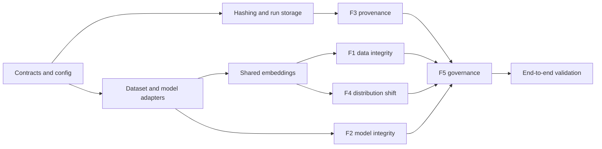

# Sentinel Phase 2 - Implementation Flow

**Document ID:** SENTINEL-P2-IMPLEMENTATION  
**Version:** 1.1  
**Delivery window:** Less than 2 calendar days; planned completion by T+44 hours  
**Repository root:** `D:\SIH\sentinel`  
**Implementation language:** Python 3.10

## 1. Delivery Strategy

Implementation proceeds contract-first. Schemas, typed domain objects, canonicalization, and deterministic fixtures are established before feature engines. Each module is independently testable, but integration remains a single sequential process. No frontend work is included.

The sub-48-hour constraint requires concurrent implementation workstreams and a frozen scope. It does not change the deployed architecture: the Sentinel application remains one sequential Python process. The countdown begins only when the repository, pinned offline wheelhouse, CIFAR-10/SVHN data, extractor weights, and clean-reference/benchmark training inputs are present locally. Formal BadNets training should use an available compatible GPU; the assurance pipeline itself retains its CPU baseline.

The build order follows technical dependency rather than presentation order:



## 2. Repository Structure

```text
D:\SIH\sentinel\
|-- README.md
|-- pyproject.toml
|-- requirements.txt
|-- requirements-dev.txt
|-- .gitignore
|-- configs\
|   |-- default.yaml
|   |-- thresholds.yaml
|   `-- coverage_manifest.yaml
|-- schemas\
|   |-- finding.schema.json
|   |-- assurance-report.schema.json
|   |-- inference-provenance.schema.json
|   |-- audit-log.schema.json
|   |-- coverage-statement.schema.json
|   `-- run-manifest.schema.json
|-- sentinel\
|   |-- __init__.py
|   |-- __main__.py
|   |-- pipeline.py
|   |-- core\
|   |   |-- __init__.py
|   |   |-- enums.py
|   |   |-- models.py
|   |   |-- errors.py
|   |   |-- normalizers.py
|   |   `-- schema_registry.py
|   |-- adapters\
|   |   |-- __init__.py
|   |   |-- datasets.py
|   |   `-- models.py
|   |-- modules\
|   |   |-- __init__.py
|   |   |-- data_integrity.py
|   |   |-- model_integrity.py
|   |   |-- inference_provenance.py
|   |   |-- distribution_shift.py
|   |   `-- governance.py
|   `-- utils\
|       |-- __init__.py
|       |-- embeddings.py
|       |-- hashing.py
|       |-- paths.py
|       |-- atomic_io.py
|       `-- config.py
|-- scripts\
|   |-- generate_synthetic_models.py
|   |-- inject_label_flips.py
|   |-- generate_duplicate_fixture.py
|   |-- generate_ood_fixture.py
|   `-- verify_run.py
|-- tests\
|   |-- fixtures\
|   |-- unit\
|   |   |-- test_hashing.py
|   |   |-- test_atomic_io.py
|   |   |-- test_normalizers.py
|   |   |-- test_dataset_adapter.py
|   |   |-- test_model_adapter.py
|   |   |-- test_data_integrity.py
|   |   |-- test_model_integrity.py
|   |   |-- test_provenance.py
|   |   |-- test_distribution_shift.py
|   |   `-- test_governance.py
|   |-- integration\
|   |   |-- test_end_to_end_clean.py
|   |   |-- test_end_to_end_poisoned.py
|   |   |-- test_unavailable_paths.py
|   |   `-- test_fail_open.py
|   `-- acceptance\
|       |-- test_f1_metrics.py
|       |-- test_f2_badnets.py
|       |-- test_f3_mutations.py
|       `-- test_f4_ood.py
|-- reference_models\                 # operator/generated, gitignored
|-- reference_data\                   # operator-provided, gitignored
|-- wheelhouse\                       # offline packages, gitignored
|-- cache\                            # derived embeddings/spectra, gitignored
|-- output\
|   |-- staging\
|   `-- runs\
`-- docs\
    `-- phase2\                       # copies or links to governing specifications
```

## 3. Module Contracts

### 3.1 Core domain layer

Implement enums before engines:

```text
Pillar: F1, F2, F3, F4, F5
Disposition: ACCEPT, REVIEW, QUARANTINE, INCONCLUSIVE
Severity: INFORMATIONAL, LOW, MEDIUM, HIGH, CRITICAL
ModuleStatus: COMPLETED, PARTIAL, UNAVAILABLE, FAILED
TaskType: CLASSIFICATION, OBJECT_DETECTION, SEGMENTATION
ModelFormat: PYTORCH, TORCHSCRIPT, ONNX
ProvenanceStatus: SIGNED, UNSIGNED
VerificationVerdict: VALID, TAMPERED, CHAIN_BROKEN, UNAVAILABLE, UNSUPPORTED
```

Enum member names are uppercase in Python. Their JSON values are the lowercase spellings defined by the six schemas (for example, `Disposition.REVIEW.value == "review"`).

Domain objects must match the Backend Schema document. Engine code may not emit ad hoc dictionaries; conversion to dictionaries happens at the serialization boundary.

### 3.2 Configuration

Configuration loading shall:

1. parse local YAML;
2. reject unknown security-sensitive keys;
3. resolve defaults into an explicit materialized configuration;
4. normalize paths relative to `D:\SIH\sentinel` or an explicitly supplied input root;
5. validate threshold ranges and resource limits;
6. exclude the HMAC secret from the configuration object; and
7. produce a canonical configuration digest.

### 3.3 Adapters

Dataset adapters produce occurrence-preserving `DatasetManifest` objects. Model adapters expose stable `forward`, `state_dict`, `architecture_id`, `format`, and `digest` operations. Stub adapters for deferred formats raise typed `CapabilityDeferredError` containing capability and target phase.

## 4. Sub-48-Hour Implementation Plan

The schedule has a T+44-hour target, leaving four hours before the two-day boundary for recovery from integration or packaging failures. Workstreams may overlap, but every merge must preserve the contract-first dependency order shown above.

### T+0 to T+4 hours - Foundation, contracts, and benchmark kickoff

- Create the repository tree, packaging metadata, lint/test configuration, and `.gitignore`.
- Materialize the six JSON Schema files and implement enums, immutable domain models, typed errors, configuration loading, and the schema registry.
- Add golden valid/invalid schema fixtures.
- Start the deterministic BadNets generation queue immediately using seeds 42-46; retain metadata for every rejected run.
- Implement the exact 3x3 checkerboard transform and clean/poison quality-gate metric collection before long-running training begins.

**Exit gate:** schemas load offline, contract fixtures pass, and benchmark jobs are producing attributable checkpoints and metrics.

### T+4 to T+10 hours - Security/storage primitives and adapters

- Implement streaming SHA-256, strict key parsing, domain-separated HMAC, constant-time verification, and canonical JSON.
- Implement safe allowed-root resolution, reparse-point checks, exclusive staging creation, atomic file replacement, and final directory rename.
- Implement authenticated ledger construction and verification.
- Implement classification manifest ingestion, bounded image validation, PyTorch/TorchScript adapters, and typed deferred-capability stubs.
- Implement frozen ResNet-18 embeddings and content-bound cache identities.

**Exit gate:** deterministic MAC vectors and chain-mutation tests pass; a CIFAR-10 subset produces repeatable 512-D embeddings without invalid cache reuse.

### T+10 to T+20 hours - F1 and F3 in parallel

**F1 workstream**

- Implement fold-local StandardScaler and class-balanced logistic regression with stratified five-fold OOF probabilities.
- Integrate CleanLab, pHash/Hamming matching, chunked top-10 cosine search, duplicate clusters, Isolation Forest, and source chi-square policy.

**F3 workstream**

- Implement canonical float32 output persistence, component digests, binding HMAC, authenticated append, and read-only verification.
- Implement the `UNSIGNED` fail-open path and fixed `REVIEW` control finding.

**Exit gate:** seeded F1 fixtures emit stable schema-valid findings, while F3 detects component mutation, metadata mutation, internal deletion/reordering, missing evidence, invalid keys, and append failures.

### T+20 to T+30 hours - F2, F4, and benchmark qualification

**F2 workstream**

- Implement tensor selection, shape validation, float64 SVD, L1 spectrum normalization, spectrum caching, and exact architecture/key/shape matching.
- Implement per-layer Wasserstein distances, 95th-percentile aggregation, leave-one-out calibration, and `nextafter` maximum-clean thresholding.

**F4 workstream**

- Implement Ledoit-Wolf fitting, reference Mahalanobis CDF/thresholds, stable float32 softmax, entropy ratio, zero-denominator handling, and suspicious-model dependency annotation.

**Benchmark workstream**

- Continue deterministic seeds until five qualifying clean and five qualifying poisoned ResNet-18 models exist.
- Run one clean and one poisoned VGG-16 compatibility smoke test.
- Inventory rejected and accepted runs with their gates and digests.

**Exit gate:** F2 and F4 unit/fixture tests pass, qualifying benchmark artifacts are inventoried, and any benchmark shortfall is recorded rather than concealed.

### T+30 to T+36 hours - F5 governance and complete orchestration

- Implement the normalizer registry, canonical finding validation, fixed policy exceptions, maximum-disposition aggregation, and all-unavailable handling.
- Generate the coverage statement, disposition trace, assurance report, audit log, and run manifest.
- Connect F1 through F5 in `pipeline.py`, including staging, schema validation, two-level manifest/audit commitment, and atomic finalization.

**Exit gate:** clean, poisoned, unavailable, partial, tampered, and unsigned scenarios reach their specified dispositions and produce internally consistent artifacts.

### T+36 to T+42 hours - Integrated acceptance and security verification

- Run end-to-end clean and poisoned workflows plus F1/F2/F3/F4 acceptance suites.
- Test path traversal, duplicate identifiers, non-finite tensors, malformed keys, output collisions, partial writes, and missing/modified evidence.
- Run with outbound networking disabled and the prebuilt wheelhouse.
- Record sample sizes, seeds, dependency versions, machine profile, rejected benchmark runs, cold/cached runtime, and peak memory.

**Exit gate:** no finalized run contains schema-invalid or unverifiable protected artifacts; actual acceptance metrics and any misses are explicitly recorded.

### T+42 to T+44 hours - Offline packaging and handoff

- Finalize the README, usage examples, coverage limitations, and verification commands.
- Perform the clean-environment offline installation rehearsal.
- Freeze the prototype package/tag without claiming SIH-final or production readiness.
- Preserve the remaining four hours as contingency; it is not additional scope capacity.

**Exit gate:** all release evidence is present and the implementation is handed off before T+48 hours. If a release gate remains unmet, the result is labeled incomplete with the exact missing evidence instead of extending the deadline or weakening the requirement.

## 5. Exact Confidence Normalizer Registry

Every normalizer has a stable identifier stored in findings.

| Finding | Normalizer ID | Mapping |
|---|---|---|
| Label error | `cleanlab_inverse_quality_v1` | `clamp(1 - q, 0, 1)` |
| pHash duplicate | `phash_hamming_v1` | `0.70 + 0.30*(8-d)/8`, only `d<=8` |
| Cosine duplicate | `cosine_similarity_v1` | `0.70 + 0.30*(s-0.95)/0.05`, only `s>=0.95` |
| Isolation outlier | `empirical_percentile_v1` | percentile of adverse score within assessed set |
| Weight spectral | `threshold_excess_v1` | `0.70 + 0.30*min((D-T)/max(T,eps),1)`, only `D>T` |
| Mahalanobis OOD | `reference_percentile_v1` | percentile against reference distances |
| Low entropy ratio | `low_entropy_ratio_v1` | `0.70 + 0.30*(0.7-R)/0.7`, only `R<=0.7` |
| Possible drift | `fixed_review_policy_v1` | fixed REVIEW; confidence records anomaly strength only |
| Source concentration | `source_rule_v1` | fixed rule based on p-value and rate multiplier |
| Unsigned provenance | `unsigned_policy_v1` | fixed REVIEW |

All arithmetic is clamped to `[0,1]`. Every finding retains the unmodified raw score and decision threshold. These transformations support deterministic policy routing but remain `uncalibrated`.

## 6. Synthetic Benchmark Procedure

### 6.1 Model generation

For each initial seed 42-46:

1. deterministically initialize and train a clean ResNet-18;
2. train a separate poisoned ResNet-18 using 10% non-target samples stamped and relabeled to class 0;
3. evaluate clean test accuracy;
4. stamp the trigger onto every non-target test image;
5. evaluate clean-model triggered target rate or poisoned-model ASR;
6. accept only if the applicable gates pass; and
7. if rejected, continue with the next unused integer seed until the required count exists.

The checkerboard overwrites the last three rows and columns of all RGB channels. White is `1.0` after tensor conversion (or 255 before conversion); black is `0.0`.

### 6.2 Threshold and evaluation

For each clean reference, compute its model score against median spectra of the other four. Set `T` to the next representable float above the largest leave-one-out score. Re-score all five clean references using the same leave-one-out procedure for the reported calibration false-positive count. Score each poisoned model against median spectra of all five clean references.

This makes the reported 0/5 clean count a calibration-set property, not an independent FPR estimate. The report must use that exact wording.

## 7. Testing Matrix

| Layer | Test type | Required cases |
|---|---|---|
| Schemas | Unit/golden | valid, missing required, extra field, invalid enum, non-finite |
| Paths | Unit | traversal, absolute/relative mismatch, reparse escape, collision |
| Crypto | Unit | fixed vectors, wrong key, field bit flip, sequence edit, predecessor edit |
| Chain | Unit | internal delete, reorder, duplicate sequence, tail limitation |
| F1 | Unit/integration | fold leakage, label flip, self-neighbor, pair symmetry, cluster transitivity, low chi-square counts |
| F2 | Unit/acceptance | conv/linear shapes, bias exclusion, incompatible architecture, zero spectrum, non-finite weights, benchmark gates |
| F3 | Unit/integration | signed, unsigned, missing evidence, altered `.npy`, changed model, malformed key |
| F4 | Unit/acceptance | singular-prone covariance, stable softmax, zero entropy, high/low/neutral ratio, suspicious-model dependency |
| F5 | Unit/integration | max disposition, policy exceptions, all unavailable, trace completeness |
| Offline | Acceptance | local wheels and artifacts only, zero network calls |

## 8. Verification Commands

The README shall expose commands equivalent to:

```powershell
python -m pytest tests\unit -q
python -m pytest tests\integration -q
python -m pytest tests\acceptance -q
python scripts\generate_synthetic_models.py --config configs\default.yaml
python -m sentinel run --config configs\default.yaml
python scripts\verify_run.py --run-dir output\runs\<report_id>
```

Commands must not print the HMAC key. Acceptance commands must write their machine profile and dependency versions alongside results.

## 9. Performance Engineering Within the Python Constraint

- Batch PyTorch inference and avoid per-image device transfers.
- Preallocate or reuse arrays where practical.
- Use NumPy/SciPy/scikit-learn compiled kernels instead of Python loops for numeric work.
- Compute cosine neighbors in chunks and keep only top-k values.
- Cache embeddings and reference spectra under content/config identities.
- Stream file hashing rather than reading large model files into one bytes object.
- Avoid repeated image decoding between F1, F3, and F4 within a run.
- Profile before changing algorithms; preserve deterministic evidence over marginal speed.

C/C++ implementation, multiprocessing, GPU-only requirements, and native IPC remain explicitly deferred.

## 10. Definition of Done

The prototype is done when:

- all five modules exist and are orchestrated in the required order;
- typed contracts and six schemas agree;
- clean and poisoned fixture runs finalize correctly;
- every adverse finding retains evidence and uncalibrated confidence provenance;
- unavailable checks never masquerade as clean checks;
- HMAC and internal chain mutations are detected within the declared threat model;
- unsigned inference forces REVIEW;
- benchmark claims use demonstration-scale language;
- completed run directories are never overwritten by Sentinel;
- the complete workflow installs and runs without network access; and
- frontend/UI code has not been introduced.
